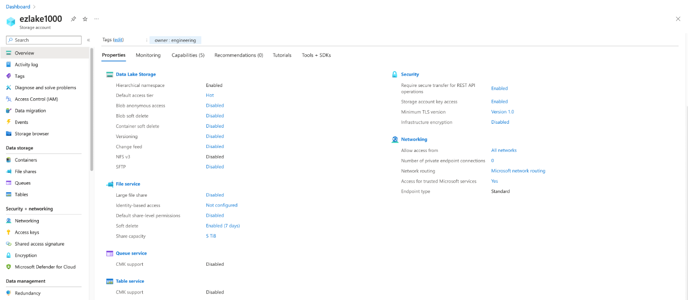
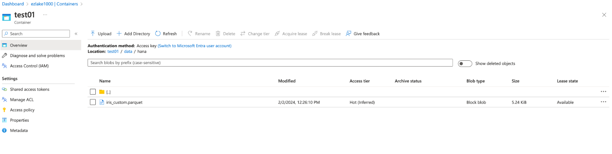
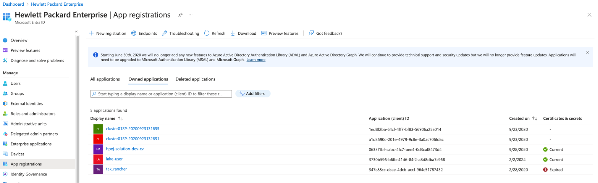
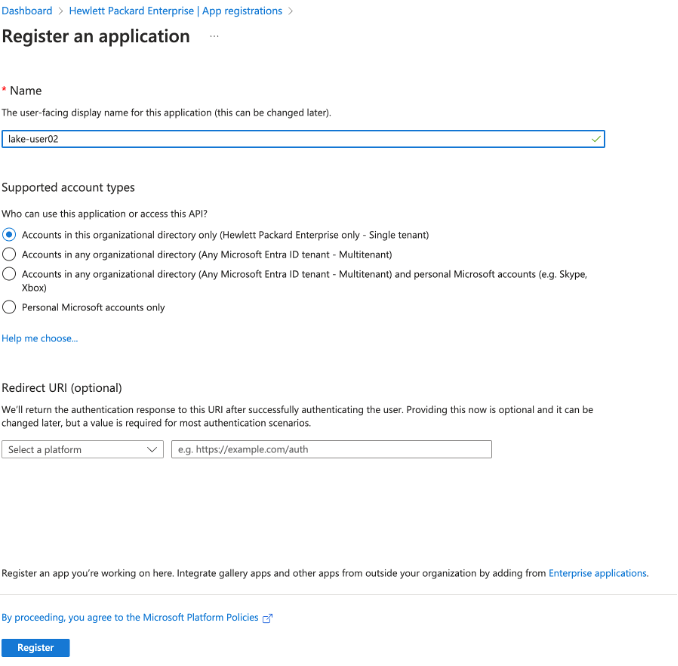
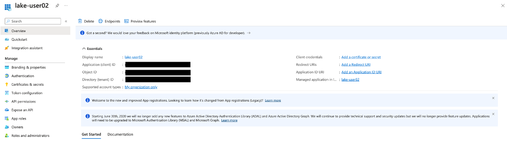
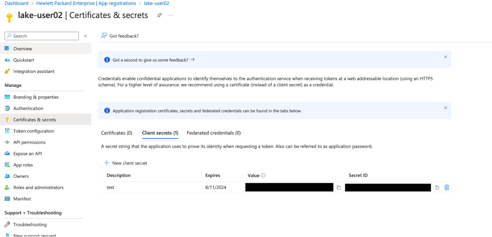
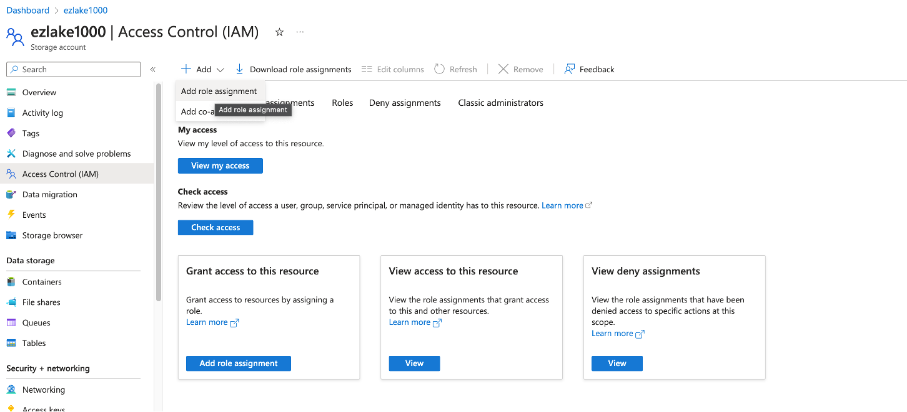
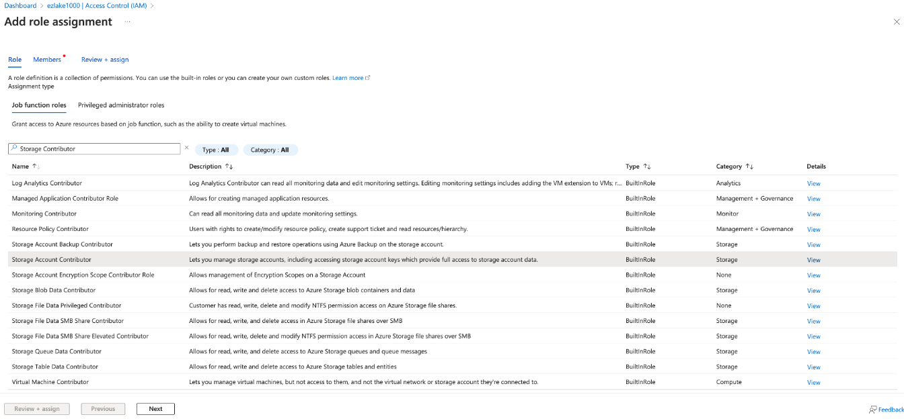
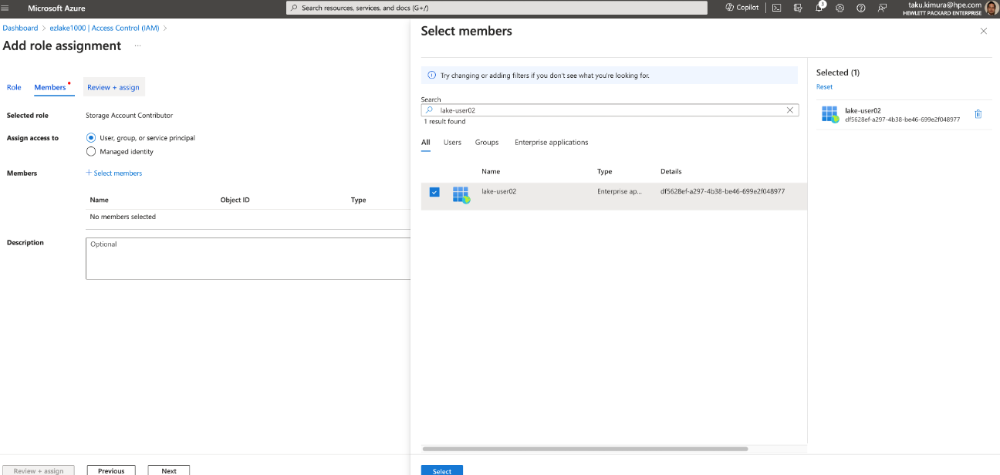
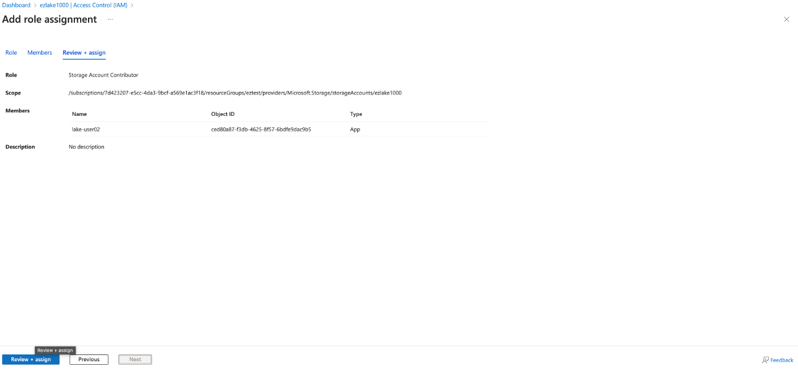

# Integrated with Azure Data Lake Storage
A procedure to use abfs driver on Ezmeral Data Fabric.  
The details of abfs are [here](https://hadoop.apache.org/docs/stable/hadoop-azure/abfs.html).


## Create Azure Data Lake Storage Gen2 and containers
### Create Azure Data Lake Gen2
First of all, you have to make Azure Data Lake Storage Gen2 in Azure.


### Create Azure Data Lake Gen2
And then make a container in that storage and store some files.  
This example is storing *iris* data as a parquet file.



## Create service principal
### App registration






\*You need to note the *Application(client) ID* and *Directory(tenant) ID*.

### Creating secret for registered Application


\*You need to note the *Value* and *Secret ID*.

### Assigning roles



Choose *Storage Contributor* as an assigned role.


Choose your Azuer Data Lake Storage Gen2 name.




### Update core-site.xml in Data Fabric
Append below values into the */opt/mapr/hadoop/hadoop-3.3.5/etc/hadoop/core-site.xml* on **all DF nodes**.

```xml
  <property>
    <name>fs.azure.always.use.https</name>
    <value>true</value>
  </property>
  <property>
    <name>fs.azure.abfs.account.name</name>
    <value>[YOUR_ADLS_NAME].dfs.core.windows.net</value>
  </property>
  <property>
    <name>fs.azure.account.auth.type</name>
    <value>OAuth</value>
  </property>
  <property>
    <name>fs.azure.account.oauth.provider.type</name>
    <value>org.apache.hadoop.fs.azurebfs.oauth2.ClientCredsTokenProvider</value>
    <description>
    Use client credentials
    </description>
  </property>
  <property>
    <name>fs.azure.account.oauth2.client.endpoint</name>
    <value>https://login.microsoftonline.com/[YOUR_DIRECTORY_ID]/oauth2/token</value>
  </property>
  <property>
    <name>fs.azure.account.oauth2.client.id</name>
    <value> [YOUR_APPLICATION_ID] </value>
  </property>
  <property>
    <name>fs.azure.account.oauth2.client.secret</name>
    <value> [YOUR_SECRET_VALUE] </value>
  </property>
  <property>
    <name>fs.azure.abfs.latency.track</name>
    <value>true</value>
  </property>
  <property>
    <name>fs.azure.account.hns.enabled</name>
    <value>true</value>
  </property>
```

### Installing ssl certs
You need to know the password to install Azure ssl certs.  
The password will be in */opt/mapr/conf/store-passwords.txt*. 
Install the certs on **all DF nodes**.

```bash
$ cat /opt/mapr/conf/store-passwords.txt  
ssl.server.keystore.password=XXXXXXXXXXXXXXXXXX
ssl.server.keystore.keypassword=XXXXXXXXXXXXXXXXXX
ssl.server.truststore.password=XXXXXXXXXXXXXXXXXX  <= This one
ssl.client.truststore.password=XXXXXXXXXXXXXXXXXX
ssl.client.keystore.password=XXXXXXXXXXXXXXXXXX
ssl.client.keystore.keypassword=XXXXXXXXXXXXXXXXXX
```

And then export ssl certs and import it.

```bash
$ openssl s_client -connect [YOUR_ADLS_NAME].dfs.core.windows.net:443 | openssl x509 -out azure_ssl_[YOUR_ADLS_NAME].cert

$ keytool -import -alias azure_certificate_[YOUR_ADLS_NAME] -file azure_ssl_[YOUR_ADLS_NAME].cert -keystore  /opt/mapr/conf/ssl_truststore
Password: 
```

After appending them, restart YARN and Hive compornents if you have.

### Check the connectivity from file system

```bash
$ hadoop  fs -ls abfs://test01@ezlake1000.dfs.core.windows.net/data/hana/
Found 1 items
-rw-r-----   1 root root       5369 2024-02-02 12:26 abfs://test01@ezlake1000.dfs.core.windows.net/data/hana/iris_custom.parquet
```
### Check the connectivity from Hive

```bash
hive> create external table iris(
    sepallength double,
    sepalwidth double,
    petallength double,
    petalwidth double,
    variety string
) 
STORED AS PARQUET
location 'abfs://test01@ezlake1000.dfs.core.windows.net/data/hana’;

hive> MSCK REPAIR table iris;

hive> select * from iris;
OK
5.1 3.5 1.4 0.2 Setosa
4.9 3.0 1.4 0.2 Setosa
4.7 3.2 1.3 0.2 Setosa
4.6 3.1 1.5 0.2 Setosa
5.0 3.6 1.4 0.2 Setosa
5.4 3.9 1.7 0.4 Setosa
….

```


