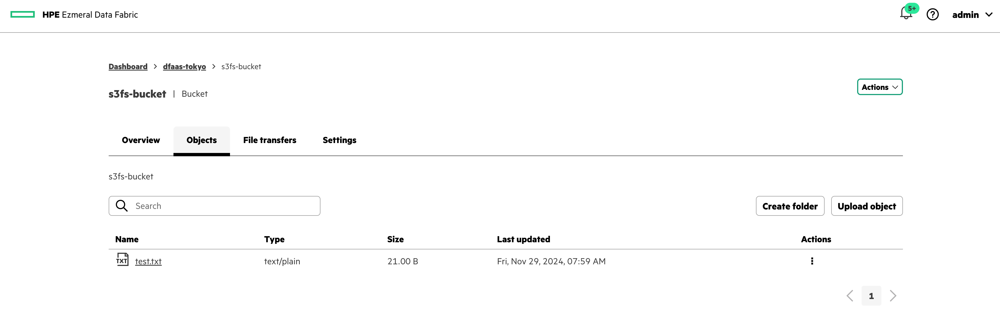
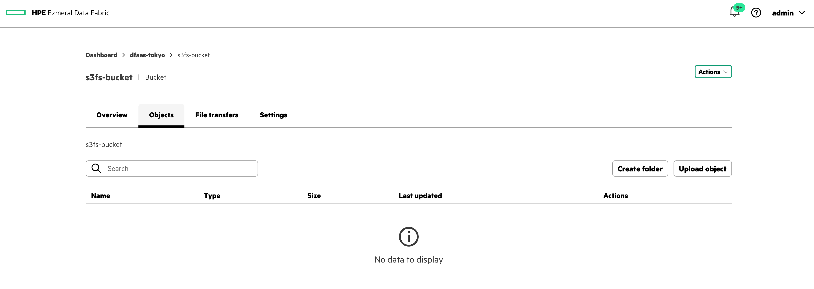

# Connecting HPE Ezmeral Data Fabric Objectstore from S3fs-fuse Client

## Test Environment
- HPE Ezmeral Data Fabric: 7.9.0
- s3fs-fuse: V1.95
  - on Rocky Linux: 9.5
  - 5.14.0-503.14.1.el9_5.x86_64

## Reference
- [s3fs-fuse Github](https://github.com/s3fs-fuse/s3fs-fuse)

## Installation
You can install *s3fs-fuse* package from *epel* repository.

```bash
$ dnf install -y epel-release
$ dnf install -y s3fs-fuse
```

## Mount bucket
### Create credetial file
To access *HPE Ezmeral Data Fabric Objectstorage*, create crendential file which has *Access Key* and *Access Key Secret*. Please replace **YOUR\_ACCESS\_KEY** and **YOUR\_ACCESS\_KEY\_SECRET** to yours in below command snipet.

```bash
$ echo YOUR_ACCESS_KEY:YOUR_ACCESS_KEY_SECRET > ~/.passwd-s3fs

$ cat .passwd-s3fs 
YOUR_ACCESS_KEY:YOUR_ACCESS_KEY_SECRET

$ chmod 600 .passwd-s3fs 
```

### Mount Data Fabric Objectstore bucket
Make mount directory and mount your bucket. Please replace **BUCKET\_NAME** and **OBJECT\_STORE\_IP** to yours.

```bash
$ mkdir /mnt/objectstore

$ s3fs BUCKET_NAME /mnt/objectstore \
-o passwd_file=/root/.passwd-s3fs \
-o use_path_request_style \
-o url=https://OBJECT_STORE_IP:9000 \
-o ssl_verify_hostname=0 \
-o no_check_certificate 
```

Now your can see objectstore like linux filesystem.

```bash
$ df -h
Filesystem           Size  Used Avail Use% Mounted on
devtmpfs             4.0M     0  4.0M   0% /dev
tmpfs                3.8G     0  3.8G   0% /dev/shm
tmpfs                1.6G  8.6M  1.5G   1% /run
/dev/mapper/rl-root   92G  1.9G   90G   3% /
/dev/sda1            960M  230M  731M  24% /boot
tmpfs                769M     0  769M   0% /run/user/0
s3fs                  64P     0   64P   0% /mnt/objectstore <= This one
```

Let's create file.

```bash
$ echo "Hello my objectstore" >> /mnt/objectstore/test.txt
```

You can see new file in your bucket from GUI.


We can update file.

```bash
$ echo "This is s3fs-fuse client" >> /mnt/objectstore/test.txt
```

We can remove file as well.

```bash
$ rm /mnt/objectstore/test.txt
rm: remove regular file '/mnt/objectstore/test.txt'? y
```


No need to be conscious of S3 storage. It's just linux filesystem.

## TIPS
When something wrong, you can check debug log.

```bash
$ s3fs BUCKET_NAME /mnt/objectstore \
-o passwd_file=/root/.passwd-s3fs \
-o use_path_request_style \
-o url=https://OBJECT_STORE_IP:9000 \
-o ssl_verify_hostname=0 \
-o no_check_certificate \
-o dbglevel=debug -f 
```