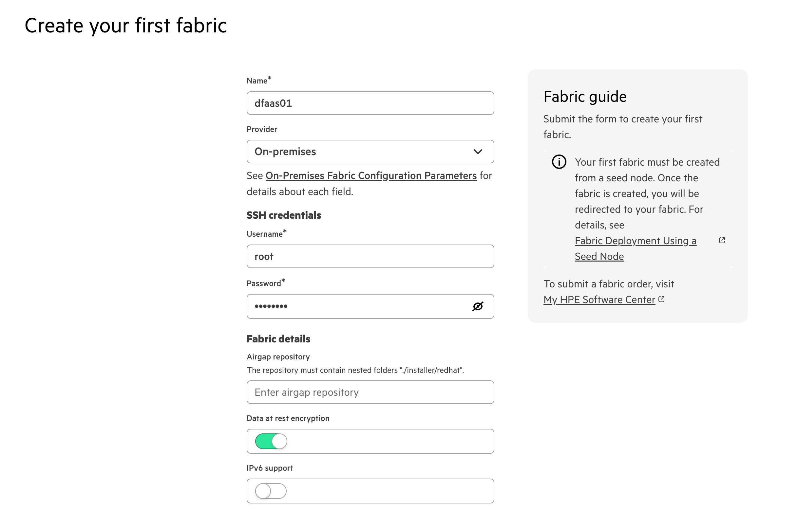
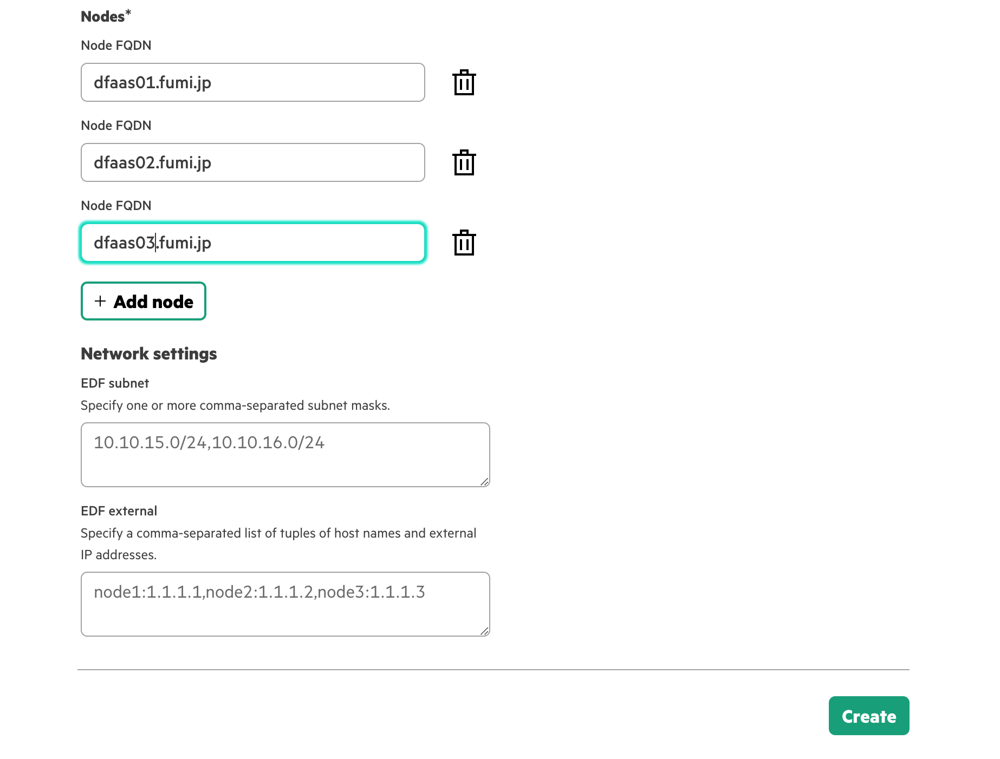
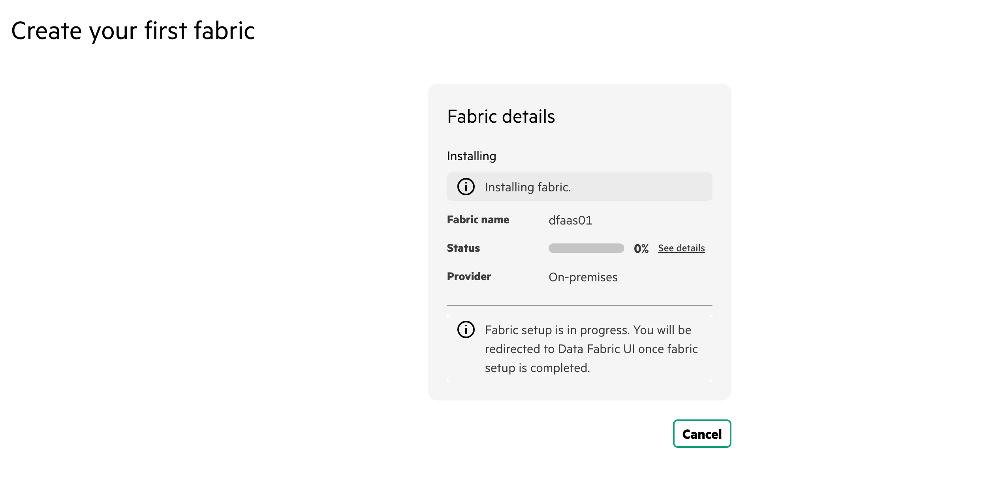
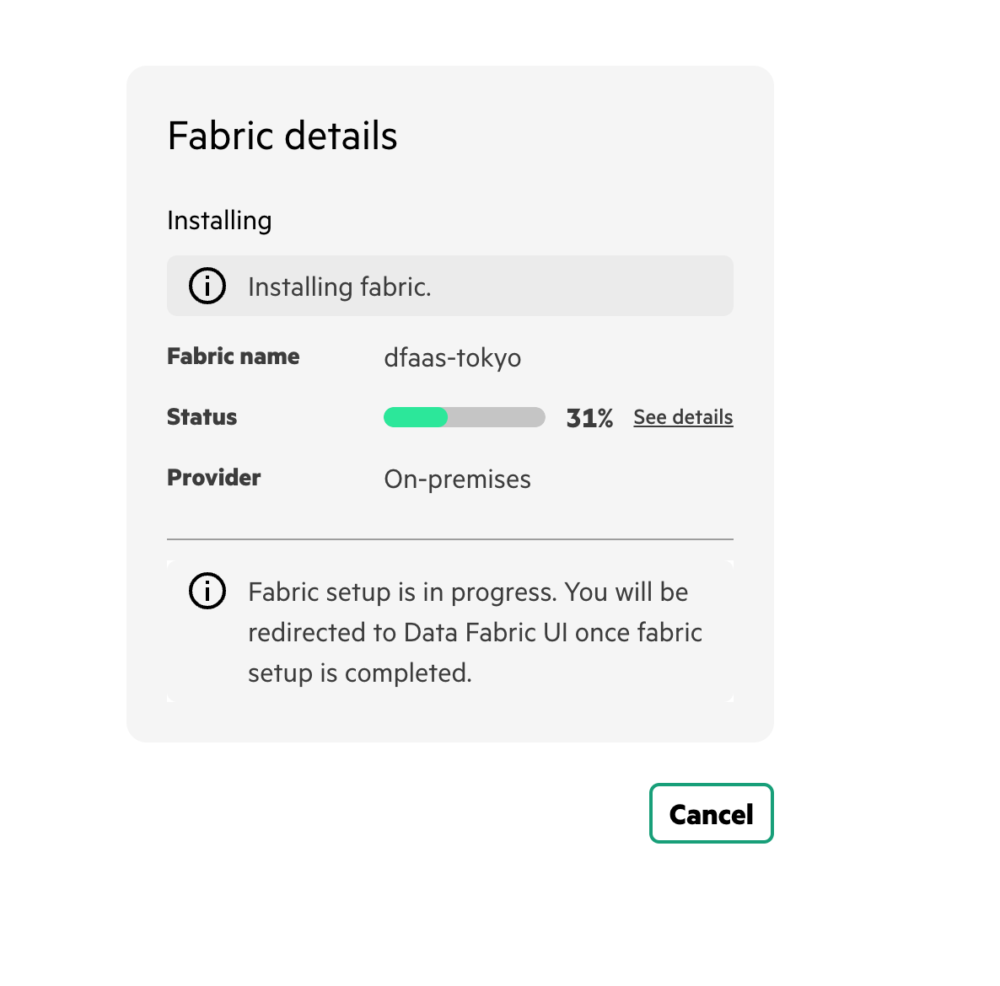
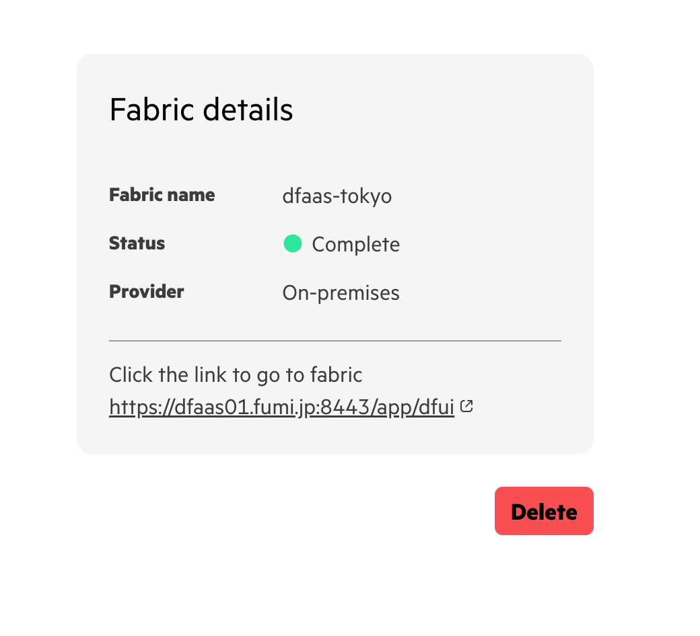
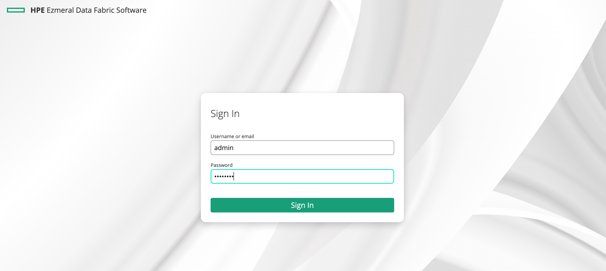
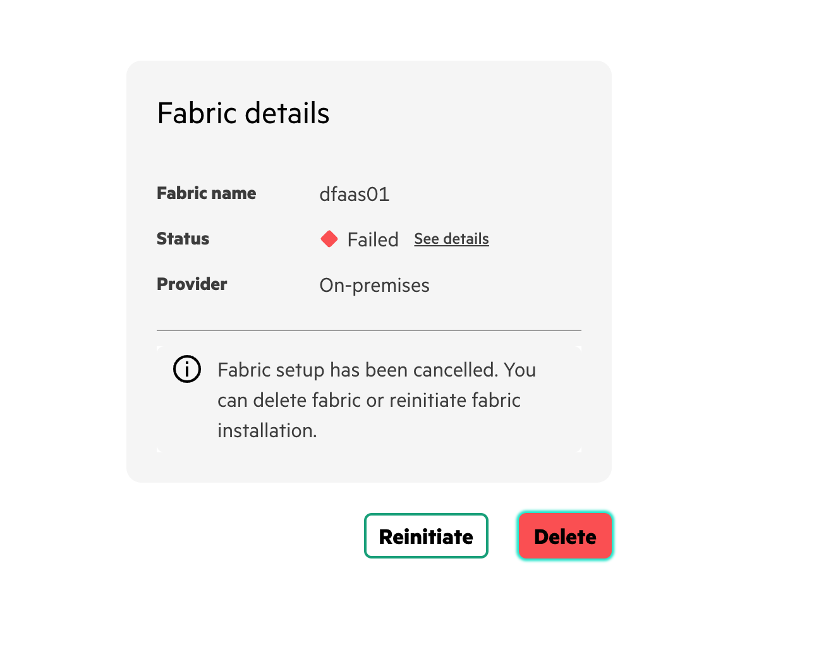

# HPE Data Fabric SaaS Edition Installation Simple Procedure
This procedure is for Data Fabric 7.9 on-premise.

## Prerequisite
- Docker environment(i.e. Rancher Desktop, Docker Desktop on your laptop etc...)
- Data Fabric nodes(at least one node)
  - [OS and HW Requierments](https://docs.ezmeral.hpe.com/datafabric/79/installation/prereqs_for_on-prem_deployment.html#concept_kg5_cxs_zwb__section_eh1_4bh_lyb)

My enviroment is below.

```bash
                            ┌────────────────┐
                            │Data Fabric Node│
                            │                │
                       ┌────►  Ubuntu 22.4   │
                       │    │    16cores     │
                       │    │    64GB RAM    │
                       │    │                │
                       │    └────────────────┘
                       │                      
┌────────────────┐     │    ┌────────────────┐
│   Seed Node    │     │    │Data Fabric Node│
│  (Installer)   │     │    │                │
│  Ubuntu 22.4   ┼─────┼────►  Ubuntu 22.4   │
│    16cores     │     │    │    16cores     │
│    32GB RAM    │     │    │    64GB RAM    │
│                │     │    │                │
└────────────────┘     │    └────────────────┘
                       │                      
                       │    ┌────────────────┐
                       │    │Data Fabric Node│
                       │    │                │
                       └────►  Ubuntu 22.4   │
                            │    16cores     │
                            │    64GB RAM    │
                            │                │
                            └────────────────┘
```


## Run the installer on your docker environment(It's called "Seed Node")
### Get script and run
Login to your docker environment (or your laptop running Rancher Desktop) to get script and boot container images up for first installer for Data Fabric.
Actually the container image is single node Data Fabric.
You may need to wait for the booting up in 5-10 mins.


```bash
$ wget https://raw.githubusercontent.com/mapr-demos/edf-seednode-790-getting-started/main/datafabric_container_setup.sh

$ chmod +x datafabric_container_setup.sh
$ ./datafabric_container_setup.sh
		RAM NEEDED 	 :	 AVAILABLE
		docker STATUS 	 :	 RUNNING
		PORTS NEEDED 	 :	 AVAILABLE
		PROCEEDING FORWARD WITH DEPLOYING SEED NODE
Please enter the local sudo password for tak
Password:

latest: Pulling from maprtech/edf-seed-container
a8b1c5f80c2d: Pulling fs layer 
ee1ca52aea66: Pulling fs layer 
769acbea1fa8: Pulling fs layer 
...
Digest: sha256:77c04ce1e9774702116e65813401b85d7b337f42555ed9ca500b927c3d3a5795
Status: Downloaded newer image for maprtech/edf-seed-container:latest
docker.io/maprtech/edf-seed-container:latest
Developer Sandbox Container 88926314129c is running..
services required for Ezmeral Data fabric are  coming up

Client has been configured with the docker container.

Please click on the link https://10.4.16.90:8443/app/dfui to deploy data fabric
For user documentation, see https://docs.ezmeral.hpe.com/datafabric/home/installation/installation_main.html

```

Now you can see the URL of installer UI for Data Fabric.


## Install Data Fabric
After connecting installer UI, put the node infomation to install Data Fabric and push *Create* button.






You can login to Data Fabric after installation is succeeded.
The username and initial password are [here](https://docs.ezmeral.hpe.com/datafabric/79/installation/accessing_the_keycloak_admin_portal.html).



## TIPS
### Installation logs
You can check installation logs on the first Data Fabric nodes registered in installer.

```bash
$ ls /opt/mapr/installer/logs/
```

### Instalaltion failure
If installation is failed, you can remove all Data Fabric components via GUI by pushing *Delete* button.
