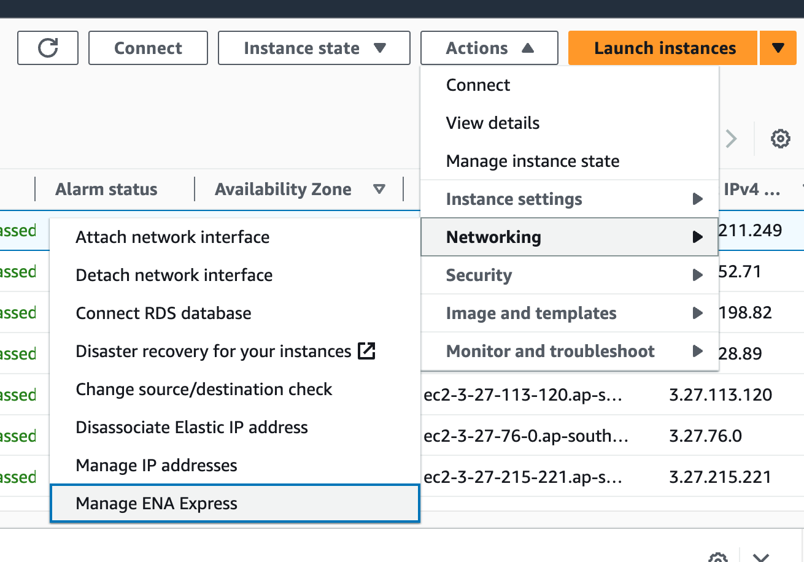
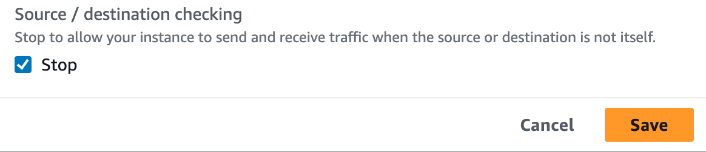

# Installation notes on AWS

## Security Group Setting
The port requirement is [here](https://docs.ezmeral.hpe.com/unified-analytics/13/Installation/ua-ports.html).   
DO NOT forget UDP setting. If you forget it, cannot communicate each k8s nodes on overlay network.

## Disable SRC/DEST traffic check
Disable Src/Dest check on each UA node ec2 instances.  

