# HPE Ezmeral Unified Analytics Installation Procedure
This is the procedure to install Ezmeral Unified Analytics(EzUA) 1.5.2 with the internet connected.

## Prerequisites
- HPE Ezmeral Data Fabric
- Ldap or AD
- Linux nodes ([OS Support](https://docs.ezmeral.hpe.com/unified-analytics/15/Reference/support-matrices.html#support-matrices__os-matrix))
  - 1 for coordinator node.
  - 1+ for master nodes.
  - 3+ for worker nodes.
- Docker node for running installer

## Installation
### on External Data Fabric Node
Before installing EzUA, creating tickets, check CA certs and generate a credential for objectstore. These are used in EzUA installation. So copy and paste them to your notebook.  
[Reference](https://docs.ezmeral.hpe.com/unified-analytics/15/Installation/ezdf-storage.html)

Creating a user **ezua** for EzUA.

```bash
export USER=ezua
export GROUP=ezua
export USERID=7000
export GROUPID=7000
export PASSWORD=password
export MOUNT_PREFIX=/ezua

$ sudo adduser --gid ${GROUPID?} --uid ${USERID?} ${USER?}
Adding user `ezua' ...
Adding new user `ezua' (7000) with group `ezua' ...
Creating home directory `/home/ezua' ...
Copying files from `/etc/skel' ...
New password: 
Retype new password: 
passwd: password updated successfully
Changing the user information for ezua
Enter the new value, or press ENTER for the default
	Full Name []: 
	Room Number []: 
	Work Phone []: 
	Home Phone []: 
	Other []: 
Is the information correct? [Y/n] 

$ echo "${USER?}:${PASSWORD?}" | sudo chpasswd
$ echo ${PASSWORD}
password
```

Creating a **ticket** to access external Data Fabric from EzUA. Don't forget to copy&paste this ticket to the notebook on your laptop.

```bash
$ maprlogin password -user mapr
[Password for user 'mapr' at cluster 'ezdf.fumi.jp': ] 
MapR credentials of user 'mapr' for cluster 'ezdf.fumi.jp' are written to '/tmp/maprticket_0'

$ maprcli acl edit -type cluster  -user ${USER?}:login,cv

$ maprcli volume create -name ezua-base-volume-${USER?} -path ${MOUNT_PREFIX?} \
-createparent true -type rw -json -rootdiruser ${USER?} -rootdirgroup ${GROUP?}
{
	"timestamp":1733293024656,
	"timeofday":"2024-12-04 03:17:04.656 GMT+0900 PM",
	"status":"OK",
	"total":0,
	"data":[
		
	],
	"messages":[
		"Successfully created volume: 'ezua-base-volume-ezua'"
	]
}

$ maprlogin generateticket -type tenant -user ${USER?} -out /tmp/maprtenantticket-${USER?}
MapR credentials of user 'ezua' for cluster 'ezdf.fumi.jp' are written to '/tmp/maprtenantticket-ezua'

$ cat /tmp/maprtenantticket-ezua
ezdf.fumi.jp aBtrCMuh6txi/4WHDGwln5jC/XrwkUpugljb7DiJLsVTvZknPVS75g8iVqsbI2h3/81YMkg7e5hn4F8MUDJyUfP7xHxXc1f2nWgQZmi96UohVxqj4AUYLMaySnjqZ5vaz0buSrtlLW0C9hxqA5I2RwJrEn+Lk8xY6r9PbOlvl7cga1J7jWtf0YxdiZlPEwDz1rphYzss9RX938Kl62FG5pQMMSKfd1HJxD9QZ03ppXq7IsGlfKoMk7iGyeM7RajrnKK/6Y8/rGCrhj7hUGf73fXXXXXXXXXXXXXXXXXXXXXXX

```

Check a **CA certs**. Don't forget to copy&paste this pem to the notebook on your laptop.


```bash
$ cat /opt/mapr/conf/ca/chain-ca.pem
```

Creat **access key** and **access key secret** in objectstore GUI. Don't forget to download it. 

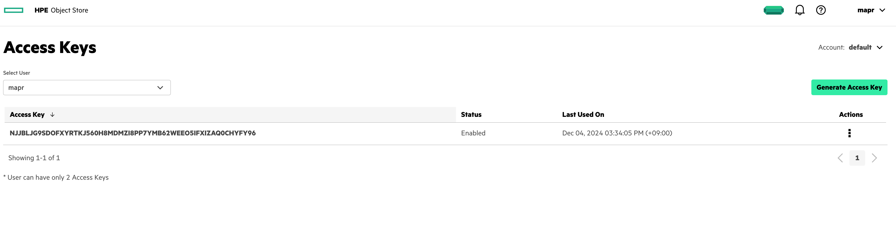

At this moment you have

- Data Fabric Ticket file
- Data Fabric CA pem file
- Data Fabric objectstore access key and secret file

### on Docker Node
To run installer, execute script downloaded from [HPE Software Center](https://myenterpriselicense.hpe.com/).

```bash
$ chmod 755 start_ezua_installer_ui.sh 
$ ./start_ezua_installer_ui.sh 
Checking Docker Install
Starting install of HPE Ezmeral Unified Analytics
Note:
Before continuing,
  - If launching behind a proxy, ensure HTTP_PROXY, HTTPS_PROXY, and NO_PROXY are set properly
  - If setting custom DNS, append the argument as: --dns DNS_IP_VALUE
DEBUG: 
DNS: 
EZUA_INSTALLER_CONTAINER: marketplace.us1.greenlake-hpe.com/ezua/hpe-ezua-installer-ui:1.5.2-b64f181-7ff2c2
EZUA_INSTALLER_UI_IMAGE_NAME: hpe-ezua-installer-ui
HTTP_PROXY: 
HTTPS_PROXY: 
NO_PROXY: host.docker.internal
http_proxy: 
https_proxy: 
no_proxy: 
Do you want to continue? [y/n]: y
Starting installer
Downloading image, this may take some time.
```

After running a installer container, access to http://[Docker node IP]:8080.
You can see installer GUI.

Click *Start Installation* button.
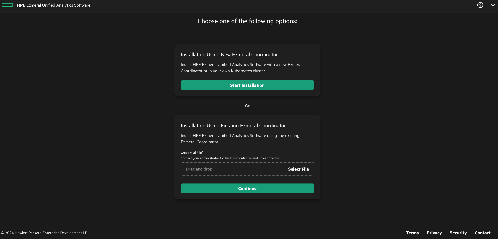

Select your deploy target.
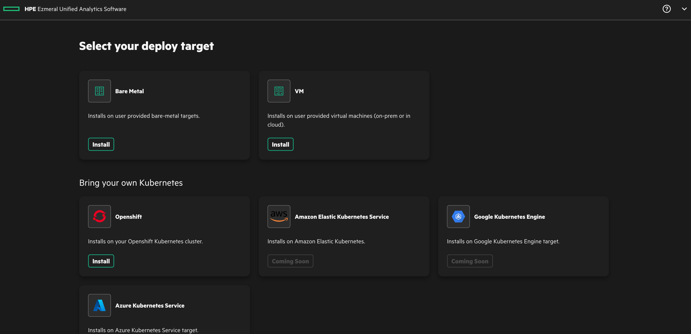

From this point, follow the prompt.
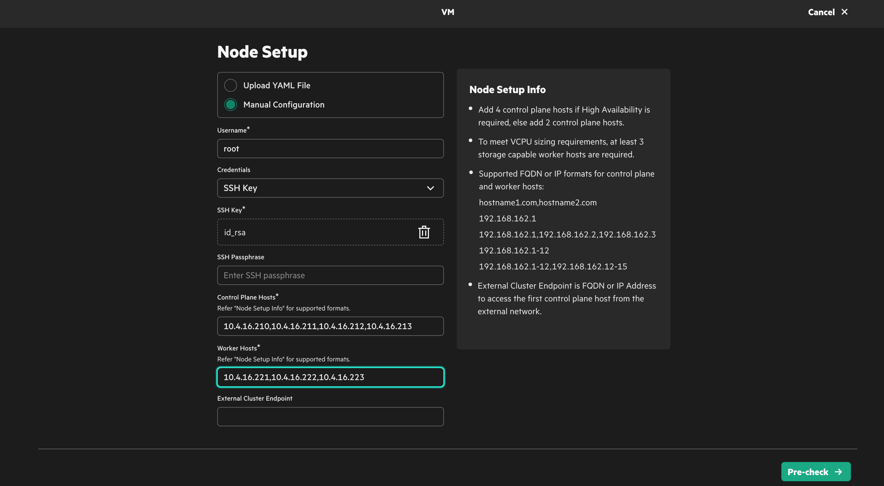

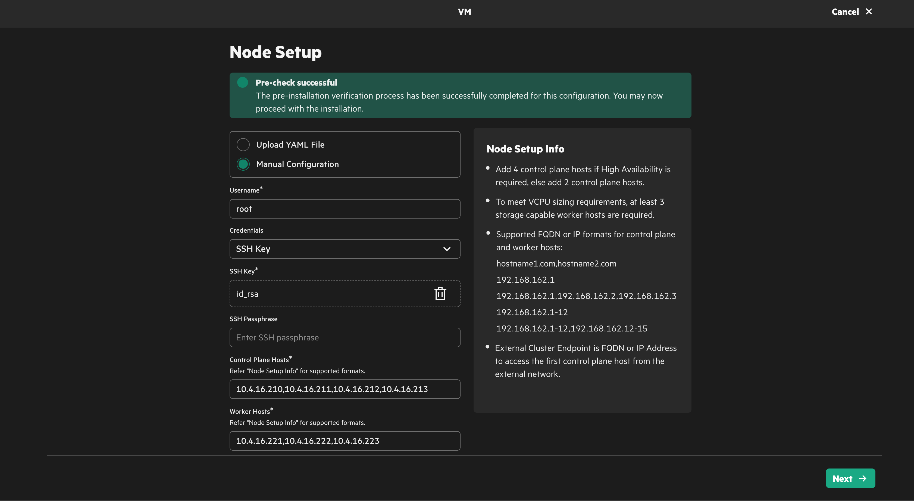

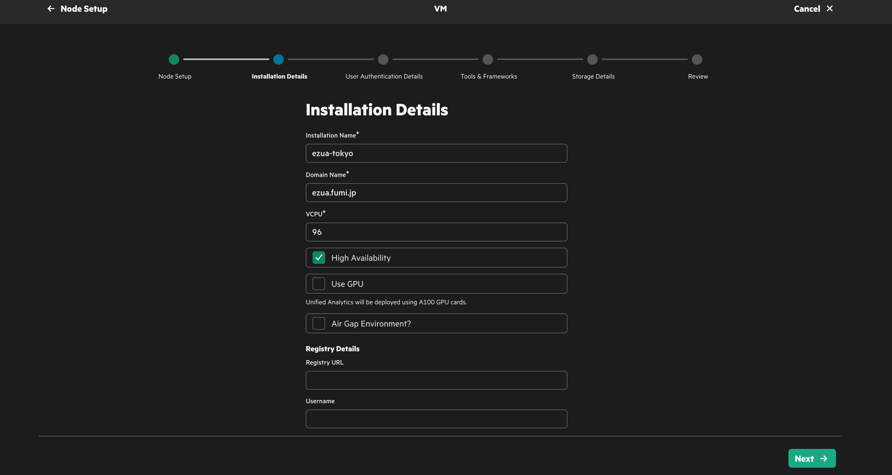

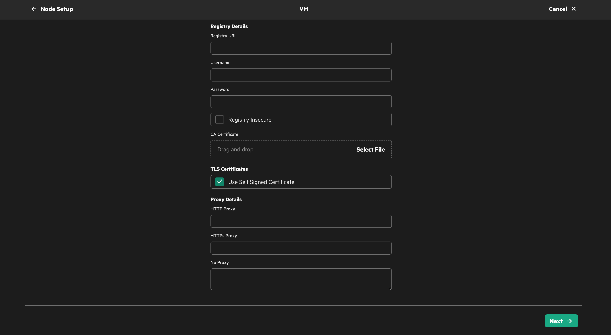

Specify your Ldap or AD server configurations.
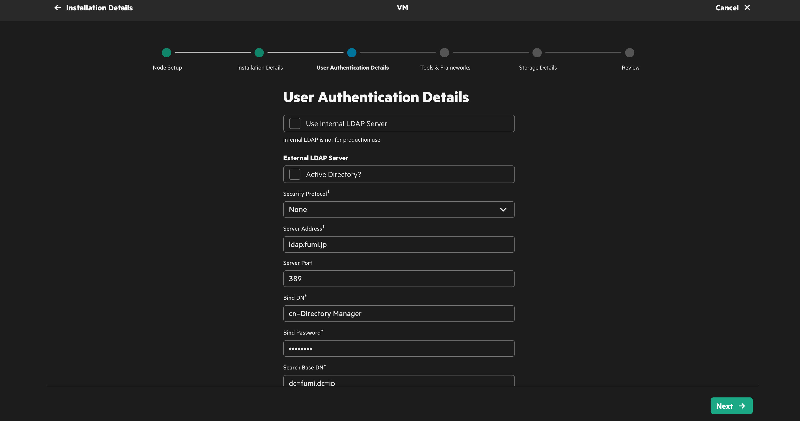

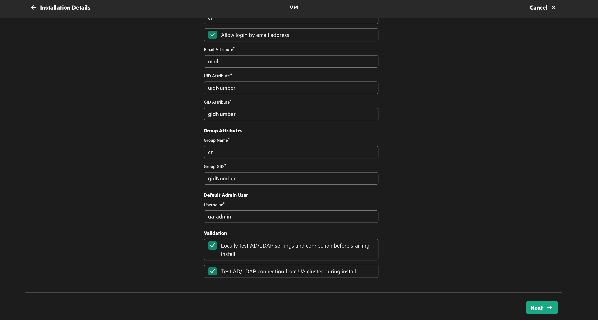

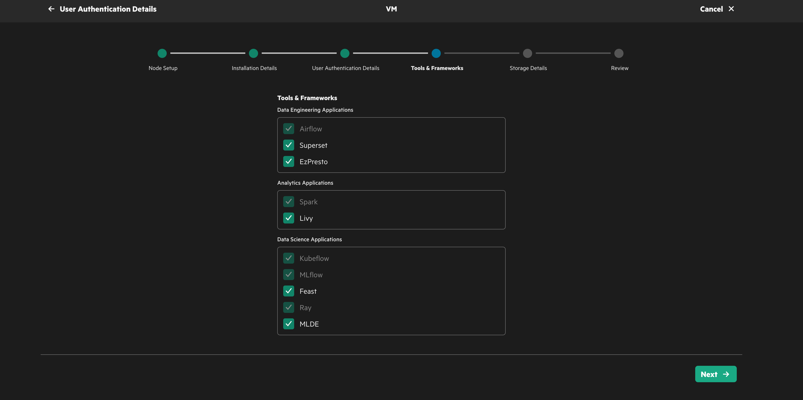

In this section, you can use external Data Fabric values you saved previous steps.
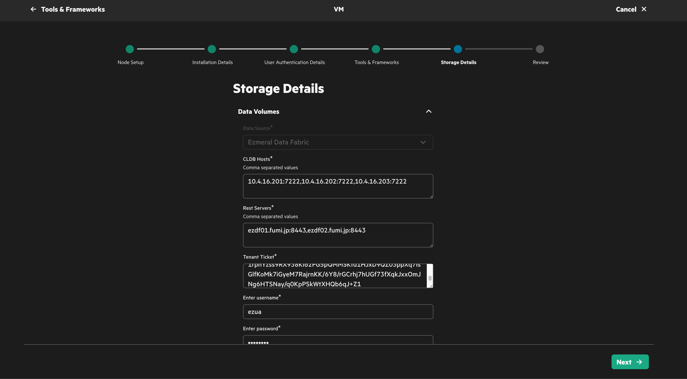

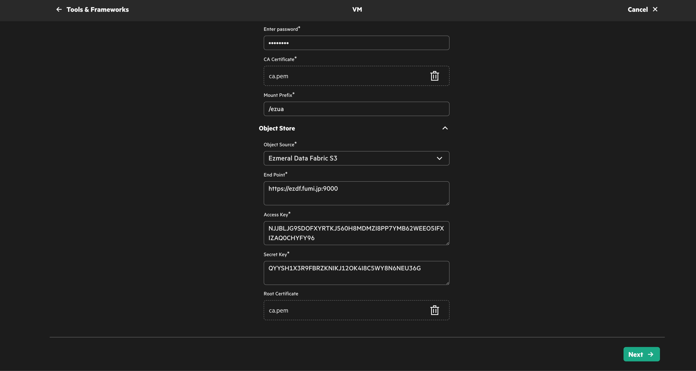

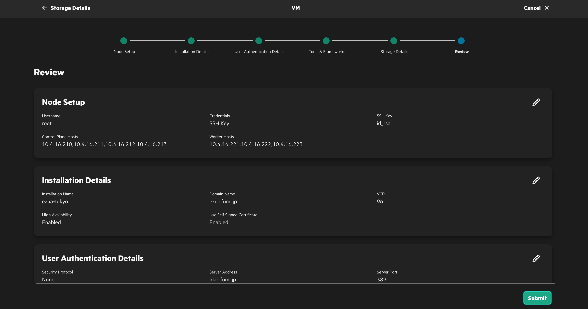

Wait for around one hour to complete installation.(depending on your internet speed.)

After the installation succeeded, set DNS record as shown in GUI.

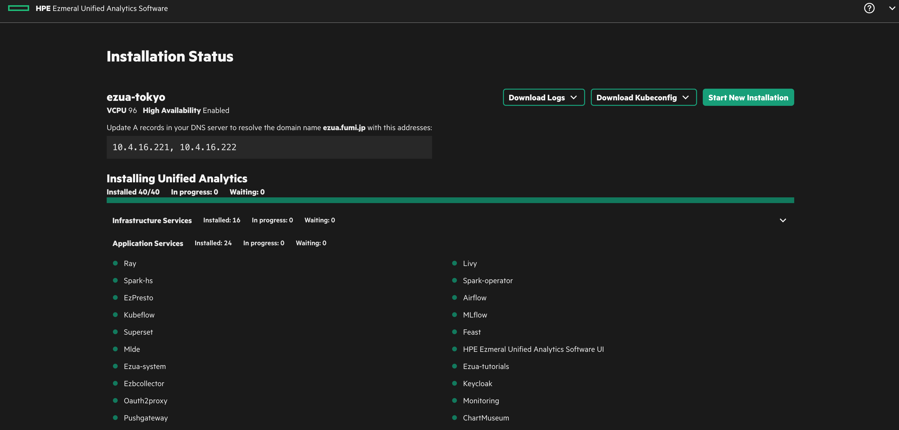