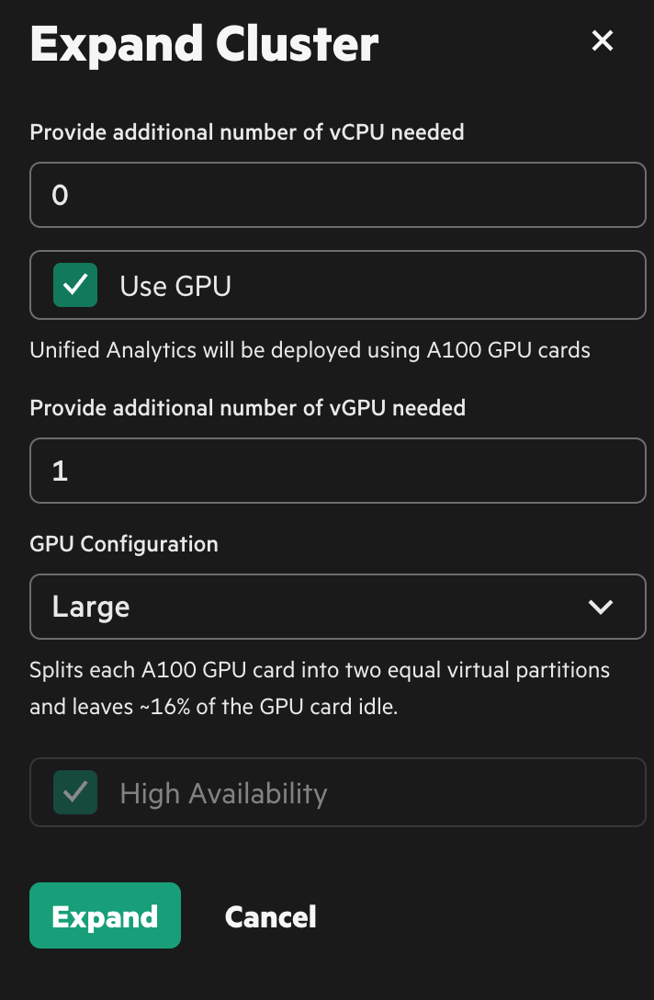
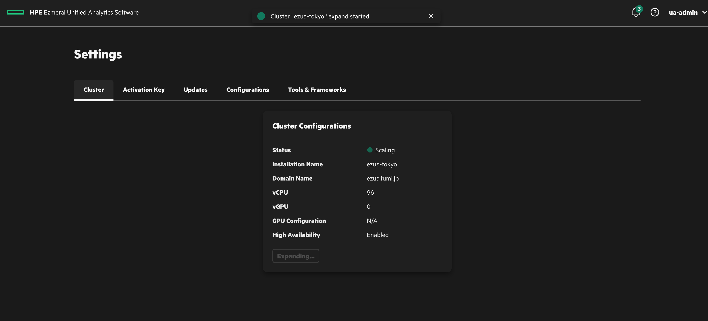
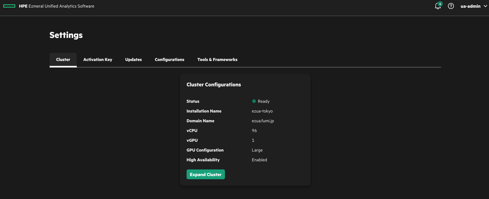

# New node to existing cluster
Adding new node after installing HPE Ezmeral Unified Analytics.

## Prerequisites
- HPE Ezmeral Unified Analyitcs
- New worker node (wiz GPU)

## Procedure
### on Cordinator node
The first step is adding new node to the node pool. you can use a script to add it.

```bash
$  curl -L -O https://github.com/HPEEzmeral/troubleshooting/releases/download/v1.5.0/ezfab-addhost-tool-1-5-x.tgz 

$ tar xvf ezfab-addhost-tool-1-5-x.tgz 
```
To add new node, create yaml file described new node information such as IP and credential. The password in the yaml should be encoded by *base64*.

```bash
$ echo -n 'password' | base64
cGFzc3dvcmQ=

$ cd ezfab-addhost-tool-1-5-x
$ vi new_node.yaml
```

The yaml file will be like below.

```yaml
defaultHostCredentials:
  sshUserName: root
  sshPassword: cGFzc3dvcmQ=

hosts:
  - host: 10.4.16.225
    labels:
      role: worker
```

Execute script to add new node.

```bash
$ chmod 755 ezfab-addhost.sh 
$ ./ezfab-addhost.sh -i new_node.yaml -k ~/.kube/config 
Check OS ...
Parse options ...
Find new_node.yaml
Find file /root/.kube/config

Running ezfabricctl to add host to pool: ./ezfabricctl poolhost init --input new_node.yaml --kubeconfig /root/.kube/config

INFO Loading/Mutating the input config file
INFO Initializing Ezmeral host(s)
INFO Validating the input config file
INFO Running precheck
INFO Installing Ezmeral host(s)
INFO Adding Ezmeral host(s) to Ezmeral host pool management
INFO Creating ezfabricpoolhost: 10.4.16.225
INFO Started monitoring the status of ezfabricpoolhost CRs
INFO Ezmeral host(s) are not ready for use. Waiting...
INFO Ezmeral host(s) are not ready for use. Waiting...
INFO Ezmeral host(s) are not ready for use. Waiting...
INFO Ezmeral host(s) are not ready for use. Waiting...
INFO Ezmeral host(s) are not ready for use. Waiting...
INFO Ezmeral host(s) are not ready for use. Waiting...
INFO Ezmeral host(s) are not ready for use. Waiting...
INFO Ezmeral host(s) are not ready for use. Waiting...
INFO Ezmeral host(s) are not ready for use. Waiting...
INFO Ezmeral host(s) are not ready for use. Waiting...
INFO Ezmeral host (10.4.16.225) is ready for use.
INFO Initialized Ezmeral host(s)

Successfully add hosts to the pool for expansion, please run the command "kubectl get ezph -A" on the coordinator(orchestrator) to check
```

Check new node status. In below case, I added a GPU node.

```bash
$ kubectl get ezph -n ezfabric-host-pool
NAME          CLUSTER NAMESPACE   CLUSTER NAME   STATUS   VCPUS   UNUSED DISKS   GPUS
10.4.16.210   ezkf-mgmt           ezkf-mgmt      Ready    4       0              0
10.4.16.211   ezua-tokyo          ezua-tokyo     Ready    4       0              0
10.4.16.212   ezua-tokyo          ezua-tokyo     Ready    4       0              0
10.4.16.213   ezua-tokyo          ezua-tokyo     Ready    4       0              0
10.4.16.221   ezua-tokyo          ezua-tokyo     Ready    32      0              0
10.4.16.222   ezua-tokyo          ezua-tokyo     Ready    32      0              0
10.4.16.223   ezua-tokyo          ezua-tokyo     Ready    32      0              0
10.4.16.225                                      Ready    32      0              1       <=This one       
```

### on Ezmeral Unified Analytics GUI
To add new node into the EzUA cluster, you can operate it in EzUA GUI. In this case, add new *GPU*-node. So I specified number of vGPU.

If you want to add non-GPU node, specify the number of CPU the node has.





### on Coordinator node
Let's check the new node status again. You can see it as the cluster imported node.

```bash
$ kubectl get ezph -A
NAMESPACE            NAME          CLUSTER NAMESPACE   CLUSTER NAME   STATUS   VCPUS   UNUSED DISKS   GPUS
ezfabric-host-pool   10.4.16.210   ezkf-mgmt           ezkf-mgmt      Ready    4       0              0
ezfabric-host-pool   10.4.16.211   ezua-tokyo          ezua-tokyo     Ready    4       0              0
ezfabric-host-pool   10.4.16.212   ezua-tokyo          ezua-tokyo     Ready    4       0              0
ezfabric-host-pool   10.4.16.213   ezua-tokyo          ezua-tokyo     Ready    4       0              0
ezfabric-host-pool   10.4.16.221   ezua-tokyo          ezua-tokyo     Ready    32      0              0
ezfabric-host-pool   10.4.16.222   ezua-tokyo          ezua-tokyo     Ready    32      0              0
ezfabric-host-pool   10.4.16.223   ezua-tokyo          ezua-tokyo     Ready    32      0              0
ezfabric-host-pool   10.4.16.225   ezua-tokyo          ezua-tokyo     Ready    32      0              1
```

### on Unified Analytics Cluster
Check the cluster node status at the side of EzUA cluster just in case.

```bash
$ kubectl get node
NAME                    STATUS   ROLES                  AGE     VERSION
ezua-master01.fumi.jp   Ready    control-plane,master   47h     v1.28.11-hpe3
ezua-master02.fumi.jp   Ready    control-plane,master   46h     v1.28.11-hpe3
ezua-master03.fumi.jp   Ready    control-plane,master   47h     v1.28.11-hpe3
ezua-worker01.fumi.jp   Ready    worker                 47h     v1.28.11-hpe3
ezua-worker02.fumi.jp   Ready    worker                 47h     v1.28.11-hpe3
ezua-worker03.fumi.jp   Ready    worker                 47h     v1.28.11-hpe3
ezua-worker05.fumi.jp   Ready    worker                 2m49s   v1.28.11-hpe3

```

In this case, I added *GPU*-node. So **Nvidia GPU Operator** detects it and create a driver pod for the GPU new node has.

```bash
$ kubectl get pod -n hpecp-gpu-operator
NAME                                                READY   STATUS    RESTARTS      AGE
gpu-node-feature-discovery-gc-685c68947f-p78tm      1/1     Running   0             47h
gpu-node-feature-discovery-master-c88546d96-2ljlj   1/1     Running   0             47h
gpu-node-feature-discovery-worker-cfhrj             1/1     Running   0             47h
gpu-node-feature-discovery-worker-cvbvz             1/1     Running   2 (46h ago)   47h
gpu-node-feature-discovery-worker-nwr7q             1/1     Running   2 (32h ago)   47h
gpu-node-feature-discovery-worker-rx7m9             1/1     Running   2 (12m ago)   26m
gpu-operator-6b9c5488d9-rd6wv                       1/1     Running   7 (32h ago)   47h
nvidia-container-toolkit-daemonset-mdf2j            1/1     Running   0             12m
nvidia-driver-daemonset-8qpfz                       1/1     Running   0             25m
nvidia-mig-manager-55qsh                            1/1     Running   0             3m32s
nvidia-operator-validator-q25rg                     1/1     Running   0             12m
```


## TIPS
When fail to add new node into coordinator node, you can delete the failure node and try again to add it.

```bash
$ kubectl get ezph -A
NAMESPACE            NAME                    CLUSTER NAMESPACE   CLUSTER NAME   STATUS   VCPUS   UNUSED DISKS   GPUS
ezfabric-host-pool   10.4.16.210             ezkf-mgmt           ezkf-mgmt      Ready    4       0              0
ezfabric-host-pool   10.4.16.211             ezua-tokyo          ezua-tokyo     Ready    4       0              0
ezfabric-host-pool   10.4.16.212             ezua-tokyo          ezua-tokyo     Ready    4       0              0
ezfabric-host-pool   10.4.16.213             ezua-tokyo          ezua-tokyo     Ready    4       0              0
ezfabric-host-pool   10.4.16.221             ezua-tokyo          ezua-tokyo     Ready    32      0              0
ezfabric-host-pool   10.4.16.222             ezua-tokyo          ezua-tokyo     Ready    32      0              0
ezfabric-host-pool   10.4.16.223             ezua-tokyo          ezua-tokyo     Ready    32      0              0
ezfabric-host-pool   10.4.16.225                                     Error                           

$ kubectl delete ezph  10.4.16.225 -n ezfabric-host-pool
ezfabricpoolhost.ezfabric.ezmeral.hpe.com "10.4.16.225" deleted
```