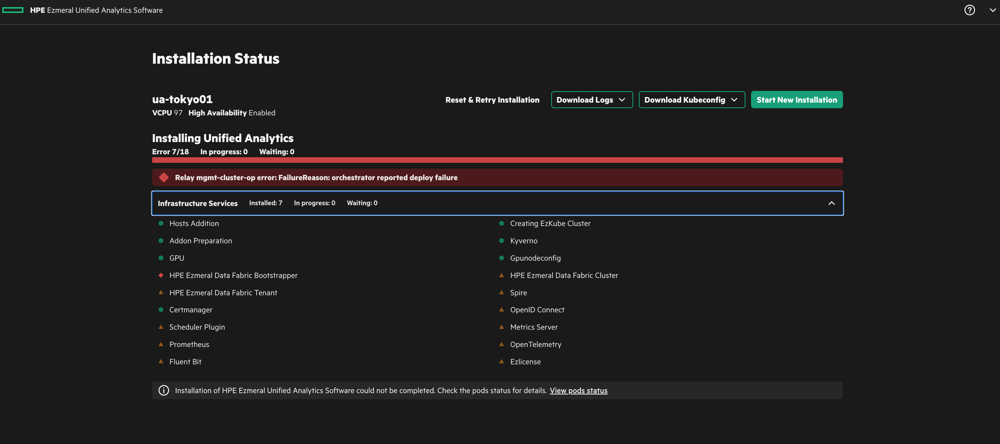

# Retry installation
When you try to install EzUA, you may face some failures in the phase of "Infrastructure Services" and "Application Service.".

From EzUA 1.4, we can use "Reset & Retry Installation" button in Installer GUI. But this feature makes all components including k8s uninstall even though k8s layer is working fine. Which means you have to wait again to install for a few hours after reset.

This is a way to retry installation without uninstalling all components.

## Installer Architecture
The GUI installer seems to be watching the status of **ezkfworkloaddeploys** k8s object and describe it on GUI. So if you see some failures on GUI installer, you can remove it and create it again to try to install again.



## Procedure
This procedure will be working fine regardless of the installation phase "Infrastructure Services" and "Application Service."  

First of all, you have to export **ezkfworkloaddeploys** configurations on the EzUA cluster. (NOT on the coordinator cluster)

```bash
$ kubectl get ezkfworkloaddeploys -n <YOUR-CLUSTER-NAME-NAMESPACE>
NAME       AGE
ua-tokyo   4m57s

$ kubectl get ezkfworkloaddeploys -o yaml -n <YOUR-CLUSTER-NAME-NAMESPACE> > ezkfworkloaddeploys.yaml
```

The YAML generated previous step will look like below. (Feast has an error in this case)

```yaml
apiVersion: v1
items:
- apiVersion: ezkfops.hpe.ezkf-ops.com/v1alpha1
  kind: EzkfWorkloadDeploy
  metadata:
    annotations:
      kubectl.kubernetes.io/last-applied-configuration: |
        {"apiVersion":"ezkfops.hpe.ezkf-ops.com/v1alpha1","kind":"EzkfWorkloadDeploy","metadata":{"annotations":{},"creationTimestamp":"2024-05-12T00:38:17Z","finalizers":["ezkfworkloaddeploy.ezkfops.hpe.com/finalizer"],"generation":1,"name":"ua-tokyo01","namespace":"ua-tokyo01","resourceVersion":"56937","uid":"7eb02916-2d74-4ae9-823e-bd1aff15711b"},"spec":{"airgap":{},"apps":{"airflow":true,"appui":true,"dataproxy":true,"ezsql":true,"feast":true,"great_expectations":true,"kubeflow":true,"kuberay":true,"livy":true,"mlflow":true,"spark":true,"superset":true},"authconfig":{"secret_name":"authconfig"},"clustername":"ua-tokyo01","deployallapps":true,"deployallinfra":true,"deploytarget":"pph","domainname":"ezua.fumi.jp","isAirgap":false,"k8sconfig":{},"proxy":{},"tlsconfig":{},"workloadtype":"ezua"},"status":{"failureReason":"","operMisc":"Relay EzkfDeploy in initial state","operState":"OperDeployGeneric","operSubstate":"RelayOpInitiated","relayCrInfo":{"relayCrKind":"EzkfDeploy","relayCrName":"deploy-ua-tokyo01","relayCrNamespace":"ua-tokyo01"},"relaySubstate":"OpPodConfirmed","status":"inprogress"}}
    creationTimestamp: "2024-05-12T00:48:05Z"
    finalizers:
    - ezkfworkloaddeploy.ezkfops.hpe.com/finalizer
    generation: 1
    name: ua-tokyo01
    namespace: ua-tokyo01
    resourceVersion: "134084"
    uid: d40e2429-43ce-4201-bbcf-334dfc029f38
  spec:
    airgap: {}
    apps:
      airflow: true
      appui: true
      dataproxy: true
      ezsql: true
      feast: true
      great_expectations: true
      kubeflow: true
      kuberay: true
      livy: true
      mlflow: true
      spark: true
      superset: true
    authconfig:
      secret_name: authconfig
    clustername: ua-tokyo01
    deployallapps: true
    deployallinfra: true
    deploytarget: pph
    domainname: ezua.fumi.jp
    isAirgap: false
    k8sconfig: {}
    proxy: {}
    tlsconfig: {}
    workloadtype: ezua
  status:
    additionalInfo: ""
    appsstatus:
    - componentname: UAPrep
      endtime: "2024-05-12T01:05:29.807919Z"
      install: true
      installstatus: INSTALLED
      starttime: "2024-05-12T01:05:06.528249Z"
    - componentname: Istio
      endtime: "2024-05-12T01:05:35.597124Z"
      install: true
      installstatus: INSTALLED
      starttime: "2024-05-12T01:05:29.831013Z"
    - componentname: Keycloak
      endtime: "2024-05-12T01:10:33.257901Z"
      install: true
      installstatus: INSTALLED
      starttime: "2024-05-12T01:05:35.613532Z"
    - componentname: OAuth2Proxy
      endtime: "2024-05-12T01:13:01.177166Z"
      install: true
      installstatus: INSTALLED
      starttime: "2024-05-12T01:10:33.278545Z"
    - componentname: Ezbcollector
      endtime: "2024-05-12T01:07:39.062196Z"
      install: true
      installstatus: INSTALLED
      starttime: "2024-05-12T01:05:29.869651Z"
    - componentname: Monitoring
      endtime: "2024-05-12T01:16:23.169625Z"
      install: true
      installstatus: INSTALLED
      starttime: "2024-05-12T01:13:01.232387Z"
    - componentname: Chartmuseum
      endtime: "2024-05-12T01:14:06.792688Z"
      install: true
      installstatus: INSTALLED
      starttime: "2024-05-12T01:13:01.203248Z"
    - componentname: EzafController
      endtime: "2024-05-12T01:27:35.077408Z"
      install: true
      installstatus: INSTALLED
      starttime: "2024-05-12T01:16:23.189556Z"
    - componentname: Kuberay
      endtime: "2024-05-12T01:46:13.772254Z"
      install: true
      installstatus: INSTALLED
      starttime: "2024-05-12T01:27:35.251625Z"
    - componentname: Spark
      install: false
      installstatus: WONT_INSTALL
    - componentname: EzPresto
      endtime: "2024-05-12T01:50:30.546826Z"
      install: true
      installstatus: INSTALLED
      starttime: "2024-05-12T01:27:35.680338Z"
    - componentname: Airflow
      endtime: "2024-05-12T01:47:47.432187Z"
      install: true
      installstatus: INSTALLED
      starttime: "2024-05-12T01:27:35.199202Z"
    - componentname: Kubeflow
      endtime: "2024-05-12T02:20:15.493013Z"
      install: true
      installstatus: INSTALLED
      starttime: "2024-05-12T01:27:35.207022Z"
    - componentname: Mlflow
      endtime: "2024-05-12T01:36:46.020675Z"
      install: true
      installstatus: INSTALLED
      starttime: "2024-05-12T01:27:35.316014Z"
    - componentname: Superset
      endtime: "2024-05-12T01:46:42.158854Z"
      install: true
      installstatus: INSTALLED
      starttime: "2024-05-12T01:27:35.287362Z"
    - componentname: AppUI
      endtime: "2024-05-12T01:29:40.382818Z"
      install: true
      installstatus: INSTALLED
      starttime: "2024-05-12T01:27:35.200725Z"
    - componentname: Feast
      endtime: "2024-05-12T02:13:11.706570Z"
      install: true
      installstatus: ERROR
      starttime: "2024-05-12T01:27:35.854439Z"
    - componentname: PostInstall
      install: false
      installstatus: WONT_INSTALL
    deployprogress: 18/18
    deploystatus: ERROR
    endtime: "null"
    failureReason: orchestrator reported deploy failure
    genericaddonsstatus:
    - componentname: Machine
      endtime: "2024-05-12T00:48:13.251314Z"
      install: true
      installstatus: INSTALLED
      starttime: "2024-05-12T00:48:10.631954Z"
    - componentname: Ezkube
      endtime: "2024-05-12T00:48:16.114791Z"
      install: true
      installstatus: INSTALLED
      starttime: "2024-05-12T00:48:13.265571Z"
    - componentname: AddonPrep
      endtime: "2024-05-12T00:48:36.191882Z"
      install: true
      installstatus: INSTALLED
      starttime: "2024-05-12T00:48:16.131255Z"
    - componentname: Kyverno
      endtime: "2024-05-12T00:48:39.314315Z"
      install: true
      installstatus: INSTALLED
      starttime: "2024-05-12T00:48:36.210319Z"
    - componentname: Gpu
      endtime: "2024-05-12T00:48:41.956723Z"
      install: true
      installstatus: INSTALLED
      starttime: "2024-05-12T00:48:39.332828Z"
    - componentname: Gpunodeconfig
      endtime: "2024-05-12T00:48:44.467818Z"
      install: true
      installstatus: INSTALLED
      starttime: "2024-05-12T00:48:42.020366Z"
    - componentname: DFBootstrapper
      endtime: "2024-05-12T00:48:54.647526Z"
      install: true
      installstatus: INSTALLED
      starttime: "2024-05-12T00:48:42.053657Z"
    - componentname: DFCluster
      endtime: "2024-05-12T00:49:07.164216Z"
      install: true
      installstatus: INSTALLED
      starttime: "2024-05-12T00:48:54.676588Z"
    - componentname: DFTenant
      endtime: "2024-05-12T00:49:19.733037Z"
      install: true
      installstatus: INSTALLED
      starttime: "2024-05-12T00:49:07.194399Z"
    - componentname: Spire
      endtime: "2024-05-12T00:49:22.265866Z"
      install: true
      installstatus: INSTALLED
      starttime: "2024-05-12T00:49:19.754196Z"
    - componentname: CertManager
      endtime: "2024-05-12T00:48:41.992272Z"
      install: true
      installstatus: INSTALLED
      starttime: "2024-05-12T00:48:39.363993Z"
    - componentname: Oidc
      endtime: "2024-05-12T00:59:00.718820Z"
      install: true
      installstatus: INSTALLED
      starttime: "2024-05-12T00:49:22.292902Z"
    - componentname: SchedulerPlugin
      endtime: "2024-05-12T01:00:05.784365Z"
      install: true
      installstatus: INSTALLED
      starttime: "2024-05-12T00:59:00.758807Z"
    - componentname: MetricsServer
      endtime: "2024-05-12T00:59:44.967547Z"
      install: true
      installstatus: INSTALLED
      starttime: "2024-05-12T00:59:00.790987Z"
    - componentname: Prometheus
      endtime: "2024-05-12T01:01:40.834218Z"
      install: true
      installstatus: INSTALLED
      starttime: "2024-05-12T00:59:44.998906Z"
    - componentname: OpenTelemetry
      endtime: "2024-05-12T01:02:45.405523Z"
      install: true
      installstatus: INSTALLED
      starttime: "2024-05-12T01:01:40.863387Z"
    - componentname: FluentBit
      endtime: "2024-05-12T01:04:00.425003Z"
      install: true
      installstatus: INSTALLED
      starttime: "2024-05-12T01:02:45.435572Z"
    - componentname: Ezlicense
      endtime: "2024-05-12T00:49:22.465143Z"
      install: true
      installstatus: INSTALLED
      starttime: "2024-05-12T00:49:19.791398Z"
    operMisc: Relay EzkfDeploy mgmt-cluster-op finished successfully
    operState: OperDeployApps
    operSubstate: OpPodInitiated
    relayCrInfo:
      relayCrKind: EzkfDeploy
      relayCrName: deploy-ua-tokyo01
      relayCrNamespace: ua-tokyo01
    relayCrStatus: complete
    relaySubstate: OpPodConfirmed
    starttime: "2024-05-12T01:05:06.286562Z"
    status: failed
kind: List
metadata:
  resourceVersion: ""
```

After exporting the configuration of **ezkfworkloaddeploys**, delete failure obejcts of **ezad** on the EzUA cluster. (NOT on the coordinator cluster)

```bash
$ kubectl get ezad -n ezaddon-system
NAME                       CLUSTER      INSTALL   STATE        PHASE     REASON                                      PROGRESS
airflow                    in-cluster   true      installed                                                          
alletra-csi                in-cluster   true      installed                                                          
cert-manager               in-cluster   true      installed                                                          
chartmuseum                in-cluster   true      installed                                                          
df-tenant                  in-cluster   true      installed                                                          
dfbootstrapper             in-cluster   true      installed                                                          
dfcluster                  in-cluster   true      installed                                                          
ezapp                      in-cluster   true      installed                                                          
ezbcollector               in-cluster   true      installed                                                          
ezcentral-charts-updater   in-cluster   true      installed                                                          
ezdata-sources             in-cluster   true      installed                                                          
ezlicense                  in-cluster   true      installed                                                          
ezpresto                   in-cluster   true      installed                                                          
ezua-ui                    in-cluster   true      installed                                                          
ezuser                     in-cluster   true      installed                                                          
feast                      in-cluster   true      failed                 addon failed while 'installing': logs:...   # REMOVE THIS FAILURE OBJECT
fluent-bit                 in-cluster   true      installed                                                          
gpu-operator               in-cluster   true      installed                                                          
gpunodeconfig              in-cluster   true      installed                                                          
istio-core                 in-cluster   true      installed                                                          
keycloak                   in-cluster   true      installed                                                          
kubeflow                   in-cluster   true      installed                                               
kuberay                    in-cluster   true      installed                                                          
kyverno                    in-cluster   true      installed                                                          
metrics-server             in-cluster   true      installed                                                          
mlflow                     in-cluster   true      installed                                                          
nfs-csi                    in-cluster   true      installed                                                          
oauth2-proxy               in-cluster   true      installed                                                          
opentelemetry-operator     in-cluster   true      installed                                                          
prometheus                 in-cluster   true      installed                                                          
pushgateway                in-cluster   true      installed                                                          
scheduler-plugin           in-cluster   true      installed                                                          
spire                      in-cluster   true      installed                                                          
superset                   in-cluster   true      installed                                                          
ua-monitor                 in-cluster   true      installed  

$ kubectl delete ezad feast -n ezaddon-system
$ kubectl delete -f ezkfworkloaddeploys.yaml
```

Some pods will be terminated in the namespace \<YOUR-CLUSTER-NAME-NAMESPACE\> on the coordinator cluster.

```bash
$ kubectl get pod -n <YOUR-CLUSTER-NAME-NAMESPACE>
NAME                                             READY   STATUS    RESTARTS        AGE
op-addonproc-ua-tokyo01                          2/2     Running   0               20h  <= will be terminated
op-clustercreate-ua-tokyo01                      1/1     Running   0               25h
ua-tokyo01-controller-manager-799f88cfb5-w4fzj   2/2     Running   9 (6h59m ago)   25h
w-op-workload-deploy-ua-tokyo01                  2/2     Running   0               20h  <= will be terminated
```


**[Before 1.4.x vesrion]** If you are at the phase of "Application Service", need to remove below **Secrets** because the orchestrator pod recreates these **Secrets** again during re-running.

```bash
$ kubectl delete secret -n ezdata-system objectstorevol local-s3-secret   
```

Now you can recreate the object **ezkfworkloaddeploys** on the EzUA cluster to try to install again.  (NOT on the coordinator cluster)

```bash
$ kubectl apply -f ezkfworkloaddeploys.yaml
```

You can see some pods are created on the coordinator cluster.

```bash
$ kubectl get pod -n <YOUR-CLUSTER-NAME-NAMESPACE>
NAME                                             READY   STATUS    RESTARTS        AGE
op-addonproc-ua-tokyo01                          2/2     Running   0               20h  <= this one
op-clustercreate-ua-tokyo01                      1/1     Running   0               25h
ua-tokyo01-controller-manager-799f88cfb5-w4fzj   2/2     Running   9 (6h59m ago)   25h
w-op-workload-deploy-ua-tokyo01                  2/2     Running   0               20h  <= this one
```

After passing installation of *HPE Ezmeral Unified Analytics Controller* in the phase of "Application Service", restart pod **local-s3-deployment** if you delete some **Secrets** in the previous step.

```bash
$ kubectl rollout restart deployment.apps/local-s3-deployment 
```

You can see the progress of re-installation in the GUI installer now...

## Notes
You may need to remove some other objects for re-installation. This depends on failure component.  
For example, if you face a failure at "OpenID Connect"(this step seems to try to install *istio*) in the phase of "Infrastructure Services", you need to remove some HELM deployments for *istiod*, *istio-core*, *istio-cni* and *istio-ingress* becasue the orchestrator tries to deploy these HELM deployments again after re-creating **ezkfworkloaddeploys**. 

For this reason, you have to check the log which you can get on GUI Installer to identify dependent objects when re-installation failed.