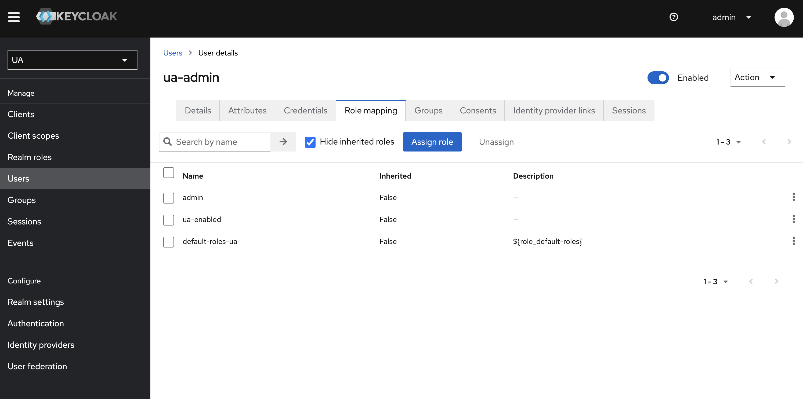
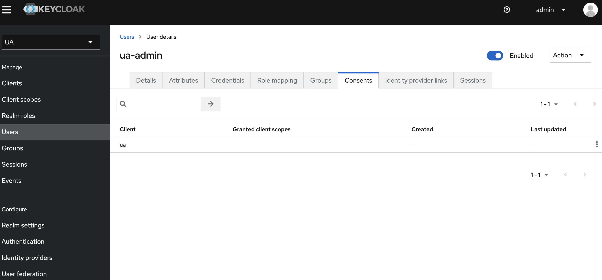

# Other topics

## Don't create namespace
When you create your namespace by kubectl or somthing, it will be gone after about 24hours.  
Ezmeral Unified Analytics is comsumption model based on CPU and GPU. They are monitoring metrics of the software they provided to calculate resource usages.  
So if we make a own namespace and deploy own software into it, they cannot calculate resource usages of user specific software. That's why they need to remove it from UA k8s cluster.  
If you want to deploy BYO software, use **App Import Feaure**.

## Expanding cluster with ssh key
When you expand cluster, you need to create YAML file for it.
And if you want to use ssh key to access new node, you have to encode it into base64.
You can use below command to encode.

```bash
cat .ssh/id_rsa | base64 | tr -d  \\n 
```

## Keycloak authorization issue after installation
If you cannot login to EzUA as admin user, check user roles in Keycloak.

Keycloak URL will be *https://keycloak.\<YOUR-DOMAIN\>*. The username is *admin* and you can get password by below command.

```bash
$ kubectl get secret admin-pass -o jsonpath={.data.password} -n keycloak |base64 -d

```

After login to Keycloak, check user roles and consent.


