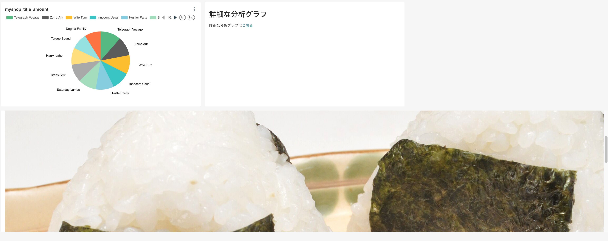

# Insert picture to Superset dashboard

## Procedure
CSP is enabled in default configuration. So need to add your picture's URLs into Superset configuration.

The Superset k8s namespace is *superset*. You can see the configuration as a *secret* in this namespace.

```bash
NAME                             TYPE                             DATA   AGE
hpe-imagepull-secrets            kubernetes.io/dockerconfigjson   1      51d
sh.helm.release.v1.superset.v1   helm.sh/release.v1               1      51d
superset-config                  Opaque                           3      51d  <= this one
superset-env                     Opaque                           7      51d
superset-postgresql              Opaque                           2      51d
```

Superset configurations is python format. Parse default configuration.

```bash
k get secret superset-config -o jsonpath={.data.'superset_config\.py'} |base64 -d 
```

The default configuration like below.

```bash

import os
from cachelib.redis import RedisCache

def env(key, default=None):
    return os.getenv(key, default)

MAPBOX_API_KEY = env('MAPBOX_API_KEY', '')
CACHE_CONFIG = {
      'CACHE_TYPE': 'RedisCache',
      'CACHE_DEFAULT_TIMEOUT': 300,
      'CACHE_KEY_PREFIX': 'superset_',
      'CACHE_REDIS_HOST': env('REDIS_HOST'),
      'CACHE_REDIS_PORT': env('REDIS_PORT'),
      'CACHE_REDIS_PASSWORD': env('REDIS_PASSWORD'),
      'CACHE_REDIS_DB': env('REDIS_DB', 1),
}
DATA_CACHE_CONFIG = CACHE_CONFIG

SQLALCHEMY_DATABASE_URI = f"postgresql+psycopg2://{env('DB_USER')}:{env('DB_PASS')}@{env('DB_HOST')}:{env('DB_PORT')}/{env('DB_NAME')}"
SQLALCHEMY_TRACK_MODIFICATIONS = True
SECRET_KEY = env('SECRET_KEY', 'thisISaSECRET_1234')

class CeleryConfig(object):
  CELERY_IMPORTS = ('superset.sql_lab', )
  CELERY_ANNOTATIONS = {'tasks.add': {'rate_limit': '10/s'}}
  BROKER_URL = f"redis://{env('REDIS_HOST')}:{env('REDIS_PORT')}/0"
  CELERY_RESULT_BACKEND = f"redis://{env('REDIS_HOST')}:{env('REDIS_PORT')}/0"

CELERY_CONFIG = CeleryConfig
RESULTS_BACKEND = RedisCache(
      host=env('REDIS_HOST'),
      port=env('REDIS_PORT'),
      key_prefix='superset_results'
)


# Overrides
# auth_config
from flask_appbuilder.security.manager import AUTH_REMOTE_USER
from superset.header_auth_security_manager import HeaderAuthenticationSecurityManager

AUTH_TYPE = AUTH_REMOTE_USER
CUSTOM_SECURITY_MANAGER = HeaderAuthenticationSecurityManager

ENABLE_PROXY_FIX = True
PROXY_FIX_CONFIG = {"x_for": 1, "x_proto": 1, "x_host": 1, "x_port": 1, "x_prefix": 1}

# Map Authlib roles to superset roles
AUTH_ROLE_ADMIN = 'Admin'
AUTH_ROLE_PUBLIC = 'Public'
# Will allow user self registration, allowing to create Flask users from Authorized User
AUTH_USER_REGISTRATION = True
# The default user self registration role 
AUTH_USER_REGISTRATION_ROLE = "Alpha"

# extend_timeout
SUPERSET_WEBSERVER_TIMEOUT = 600
SQLLAB_TIMEOUT = 600
GUNICORN_TIMEOUT = 600
GUNICORN_KEEPALIVE = 10

SQLALCHEMY_POOL_SIZE = 45
SQLALCHEMY_MAX_OVERFLOW = 30
SQLALCHEMY_POOL_TIMEOUT = 180

# feature_flags
FEATURE_FLAGS = {"DRILL_TO_DETAIL": True}
```

For insert picture, need to add below *TALISMAN_CONFIG* configuration with your image URL and then save it as a file *superset_config.py*.

```
TALISMAN_CONFIG = {
   "content_security_policy": {
      "default-src": [
         "'self'"
      ],
      "img-src": [
        "'self'", 
        "blob:", 
        "data:",
        "https://en.wikipedia.org", #<= this one
        "https://upload.wikimedia.org/", #<= this one
      ],
      "worker-src": [
         "'self'",
         "blob:"
      ],
      "connect-src": [
         "'self'",
         "https://api.mapbox.com",
         "https://events.mapbox.com",
         "https://superset.domain.com",
      ],
      "object-src": "'none'",
      "style-src": [
         "'self'",
         "'unsafe-inline'"
      ],
      "script-src": [
         "'self'"
      ],
   },
   "content_security_policy_nonce_in": [],
   "force_https": False,
}
```

After that, before updating k8s *secret* for Superset configuration. Get base64 encoded strings.

```bash
cat superset_config.py|base64  
CmltcG9ydCBvcwpmcm9tIGNhY2hlbGliLnJlZGlzIGltcG9ydCBSZWRpc0NhY2hlCgpkZWYgZW52KGtleSwgZGVmYXVsdD1Ob25lKToKICAgIHJldHVybiBvcy5nZXRlbnYoa2V5LCBkZWZhdWx0KQoKTUFQQk9YX0FQSV9LRVkgPSBlbnYoJ01BUEJPWF9BUElfS0VZJywgJycpCkNBQ0hFX0NPTkZJRyA9IHsKICAgICAgJ0NBQ0hFX1RZUEUnOiAnUmVkaXNDYWNoZScsCiAgICAgICdDQUNIRV9ERUZBVUxUX1RJTUVPVVQnOiAzMDAsCiAgICAgICdDQUNIRV9LRVlfUFJFRklYJzogJ3N1cGVyc2V0XycsCiAgICAgICdDQUNIRV9SRURJU19IT1NUJzogZW52KCdSRURJU19IT1NUJyksCiAgICAgICdDQUNIRV9SRURJU19QT1JUJzogZW52KCdSRURJU19QT1JUJyksCiAgICAgICdDQUNIRV9SRURJU19QQVNTV09SRCc6IGVudignUkVESVNfUEFTU1dPUkQnKSwKICAgICAgJ0NBQ0hFX1JFRElTX0RCJzogZW52KCdSRURJU19EQicsIDEpLAp9CkRBVEFfQ0FDSEVfQ09ORklHID0gQ0FDSEVfQ09ORklHCgpTUUxBTENIRU1ZX0RBVEFCQVNFX1VSSSA9IGYicG9zdGdyZXNxbCtwc3ljb3BnMjovL3tlbnYoJ0RCX1VTRVInKX06e2VudignREJfUEFTUycpfUB7ZW52KCdEQl9IT1NUJyl9OntlbnYoJ0RCX1BPUlQnKX0ve2VudignREJfTkFNRScpfSIKU1FMQUxDSEVNWV9UUkFDS19NT0RJRklDQVRJT05TID0gVHJ1ZQpTRUNSRVRfS0VZID0gZW52KCdTRUNSRVRfS0VZJywgJ3RoaXNJU2FTRUNSRVRfMTIzNCcpCgpjbGFzcyBDZWxlcnlDb25maWcob2JqZWN0KToKICBDRUxFUllfSU1QT1JUUyA9ICgnc3VwZXJzZXQuc3FsX2xhYicsICkKICBDRUxFUllfQU5OT1RBVElPTlMgPSB7J3Rhc2tzLmFkZCc6IHsncmF0ZV9saW1pdCc6ICcxMC9zJ319CiAgQlJPS0VSX1VSTCA9IGYicmVkaXM6Ly97ZW52KCdSRURJU19IT1NUJyl9OntlbnYoJ1JFRElTX1BPUlQnKX0vMCIKICBDRUxFUllfUkVTVUxUX0JBQ0tFTkQgPSBmInJlZGlzOi8ve2VudignUkVESVNfSE9TVCcpfTp7ZW52KCdSRURJU19QT1JUJyl9LzAiCgpDRUxFUllfQ09ORklHID0gQ2VsZXJ5Q29uZmlnClJFU1VMVFNfQkFDS0VORCA9IFJlZGlzQ2FjaGUoCiAgICAgIGhvc3Q9ZW52KCdSRURJU19IT1NUJyksCiAgICAgIHBvcnQ9ZW52KCdSRURJU19QT1JUJyksCiAgICAgIGtleV9wcmVmaXg9J3N1cGVyc2V0X3Jlc3VsdHMnCikKClRBTElTTUFOX0NPTkZJRyA9IHsKICAgImNvbnRlbnRfc2VjdXJpdHlfcG9saWN5IjogewogICAgICAiZGVmYXVsdC1zcmMiOiBbCiAgICAgICAgICInc2VsZiciCiAgICAgIF0sCiAgICAgICJpbWctc3JjIjogWwogICAgICAgICInc2VsZiciLCAKICAgICAgICAiYmxvYjoiLCAKICAgICAgICAiZGF0YToiLAogICAgICAgICJodHRwczovL2VuLndpa2lwZWRpYS5vcmciLAogICAgICAgICJodHRwczovL3VwbG9hZC53aWtpbWVkaWEub3JnLyIsCiAgICAgIF0sCiAgICAgICJ3b3JrZXItc3JjIjogWwogICAgICAgICAiJ3NlbGYnIiwKICAgICAgICAgImJsb2I6IgogICAgICBdLAogICAgICAiY29ubmVjdC1zcmMiOiBbCiAgICAgICAgICInc2VsZiciLAogICAgICAgICAiaHR0cHM6Ly9hcGkubWFwYm94LmNvbSIsCiAgICAgICAgICJodHRwczovL2V2ZW50cy5tYXBib3guY29tIiwKICAgICAgICAgImh0dHBzOi8vc3VwZXJzZXQuZG9tYWluLmNvbSIsCiAgICAgIF0sCiAgICAgICJvYmplY3Qtc3JjIjogIidub25lJyIsCiAgICAgICJzdHlsZS1zcmMiOiBbCiAgICAgICAgICInc2VsZiciLAogICAgICAgICAiJ3Vuc2FmZS1pbmxpbmUnIgogICAgICBdLAogICAgICAic2NyaXB0LXNyYyI6IFsKICAgICAgICAgIidzZWxmJyIKICAgICAgXSwKICAgfSwKICAgImNvbnRlbnRfc2VjdXJpdHlfcG9saWN5X25vbmNlX2luIjogW10sCiAgICJmb3JjZV9odHRwcyI6IEZhbHNlLAp9CgojIE92ZXJyaWRlcwojIGF1dGhfY29uZmlnCmZyb20gZmxhc2tfYXBwYnVpbGRlci5zZWN1cml0eS5tYW5hZ2VyIGltcG9ydCBBVVRIX1JFTU9URV9VU0VSCmZyb20gc3VwZXJzZXQuaGVhZGVyX2F1dGhfc2VjdXJpdHlfbWFuYWdlciBpbXBvcnQgSGVhZGVyQXV0aGVudGljYXRpb25TZWN1cml0eU1hbmFnZXIKCkFVVEhfVFlQRSA9IEFVVEhfUkVNT1RFX1VTRVIKQ1VTVE9NX1NFQ1VSSVRZX01BTkFHRVIgPSBIZWFkZXJBdXRoZW50aWNhdGlvblNlY3VyaXR5TWFuYWdlcgoKRU5BQkxFX1BST1hZX0ZJWCA9IFRydWUKUFJPWFlfRklYX0NPTkZJRyA9IHsieF9mb3IiOiAxLCAieF9wcm90byI6IDEsICJ4X2hvc3QiOiAxLCAieF9wb3J0IjogMSwgInhfcHJlZml4IjogMX0KCiMgTWFwIEF1dGhsaWIgcm9sZXMgdG8gc3VwZXJzZXQgcm9sZXMKQVVUSF9ST0xFX0FETUlOID0gJ0FkbWluJwpBVVRIX1JPTEVfUFVCTElDID0gJ1B1YmxpYycKIyBXaWxsIGFsbG93IHVzZXIgc2VsZiByZWdpc3RyYXRpb24sIGFsbG93aW5nIHRvIGNyZWF0ZSBGbGFzayB1c2VycyBmcm9tIEF1dGhvcml6ZWQgVXNlcgpBVVRIX1VTRVJfUkVHSVNUUkFUSU9OID0gVHJ1ZQojIFRoZSBkZWZhdWx0IHVzZXIgc2VsZiByZWdpc3RyYXRpb24gcm9sZSAKQVVUSF9VU0VSX1JFR0lTVFJBVElPTl9ST0xFID0gIkFscGhhIgoKIyBleHRlbmRfdGltZW91dApTVVBFUlNFVF9XRUJTRVJWRVJfVElNRU9VVCA9IDYwMApTUUxMQUJfVElNRU9VVCA9IDYwMApHVU5JQ09STl9USU1FT1VUID0gNjAwCkdVTklDT1JOX0tFRVBBTElWRSA9IDEwCgpTUUxBTENIRU1ZX1BPT0xfU0laRSA9IDQ1ClNRTEFMQ0hFTVlfTUFYX09WRVJGTE9XID0gMzAKU1FMQUxDSEVNWV9QT09MX1RJTUVPVVQgPSAxODAKCiMgZmVhdHVyZV9mbGFncwpGRUFUVVJFX0ZMQUdTID0geyJEUklMTF9UT19ERVRBSUwiOiBUcnVlfQo=
```

Update the secret to replace *superset_config.py* value to above strings.

```bash
kubectl edit -n superset superset-config 
```

Now you can insert picture exposed the URL you set to Superset dashboard.

