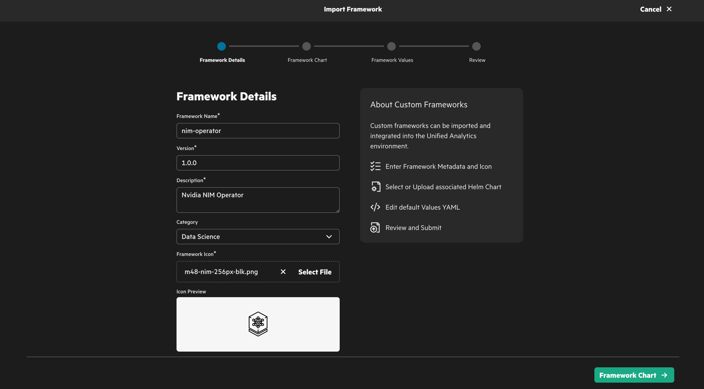
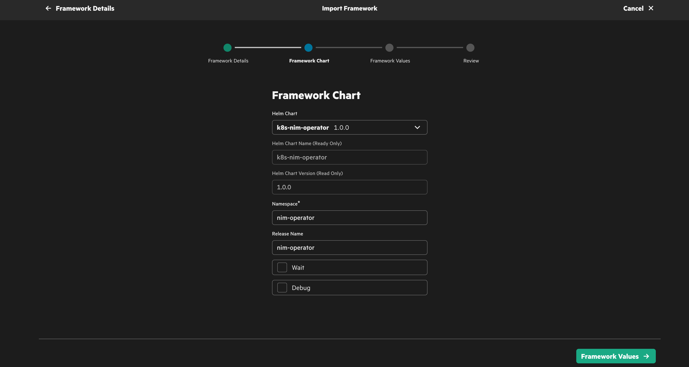
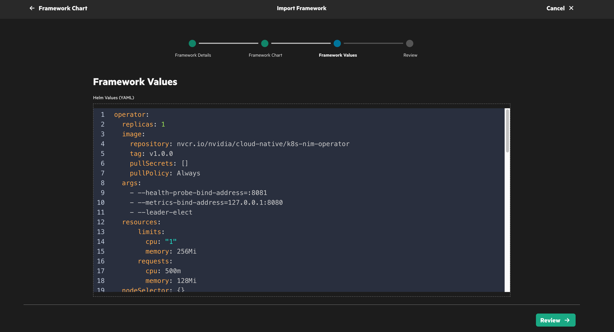
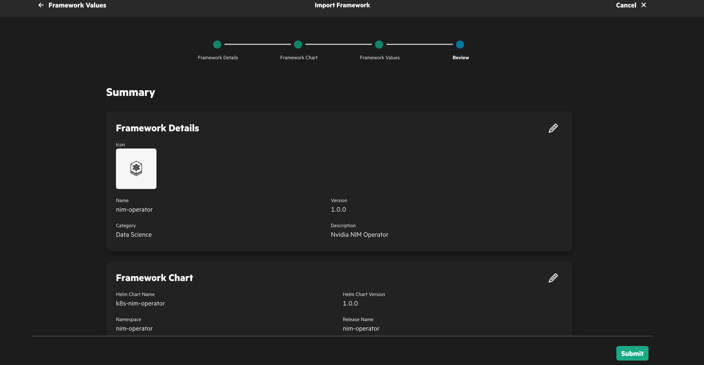
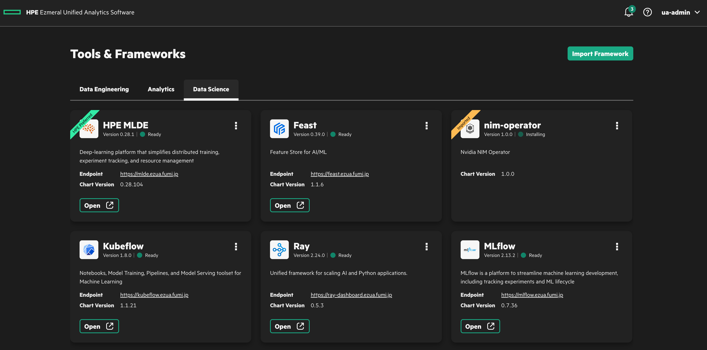
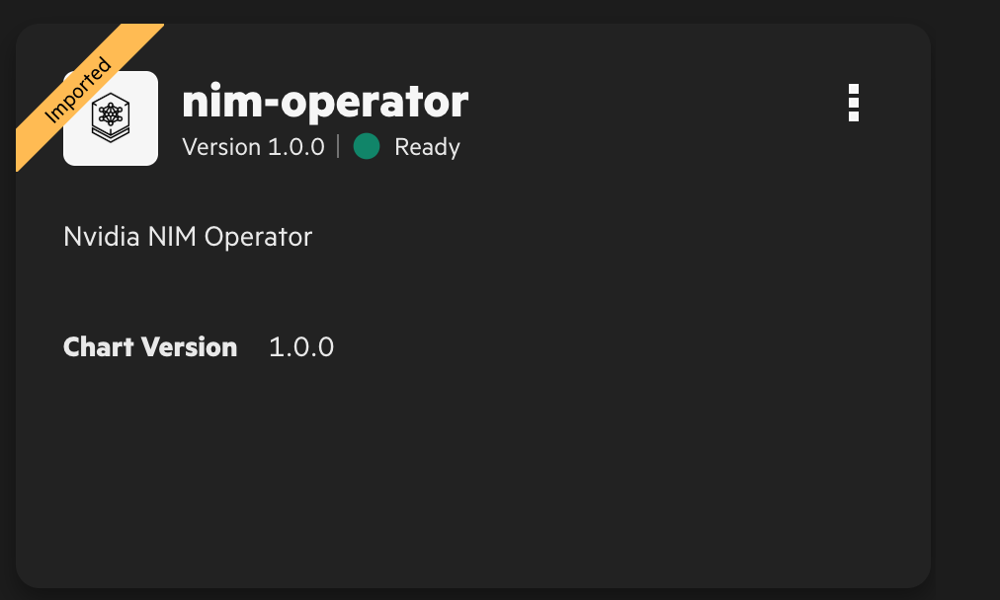

# Integrate NIM operator with HPE Ezmeral Unified Analytics(EzUA)
## Prerequisites
- HPE Ezmeral Unified Analytics
- Helm command available

## Installation

Create a *namespace* for NIM operator.

```bash
$ kubectl create namespace nim-operator
namespace/nim-operator created
```

Get a helm chart.

```bash
$ helm pull nvidia-ngc/k8s-nim-operator
```

Upload a helm chart via **EzUA Import Framework GUI**.





After submit, you can see the installation status of NIM operator.


Let's check pod status and **NIM CRDs**.

```bash
$ kubectl get pod -n nim-operator
NAME                                             READY   STATUS    RESTARTS   AGE
nim-operator-k8s-nim-operator-68d5bddbdd-tqnfn   2/2     Running   0          54s

$ kubectl api-resources |grep -i nvidia    
nimcaches                                                  apps.nvidia.com/v1alpha1                    true         NIMCache
nimpipelines                                               apps.nvidia.com/v1alpha1                    true         NIMPipeline
nimservices                                                apps.nvidia.com/v1alpha1                    true         NIMService
clusterpolicies                                            nvidia.com/v1                               false        ClusterPolicy
nvidiadrivers                     nvd,nvdriver,nvdrivers   nvidia.com/v1alpha1                         false        NVIDIADriver

```



## How to use
Please check [this article](https://github.com/fideltak/ez-cheat/tree/main/nvidia/nim/operator#nim-crds).