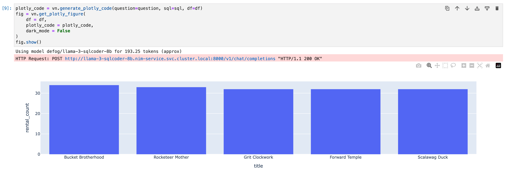

# Vanna, NIM and Presto integration

## Prequisites
- kubernetes cluster with a GPU
- Nvidia GPU Operator
- Nvidia NIM Operator
- NIM service(Llama-3-SQLCoder-8B)
- NGC token
- PostgreSQL(with [sample DVD shop data](https://neon.tech/postgresql/postgresql-getting-started/postgresql-sample-database))

Using HPE Ezmeral Unified Analytics (aka HPE AI Essentials in HPE Private Cloud AI) in this article.  
Please setup the *NIM Operator* and *NIM Service* before going below steps. The article for *NIM Operator* and *NIM Service* are

- [Integrate NIM operator with HPE Ezmeral Unified Analytics(EzUA)](../../operator_ezua)
- [NIM Operator Introduction](../../operator)

## Architecture Overview

```
                                       ┌───────────────┐                          
                                       │               │                          
                                       │  PostgreSQL   │                          
                                       │               │                          
                                       └───────▲───────┘                          
                                               │                                  
                                               │                                  
┌──────────────────────────────────────────────┼─────────────────────────────────┐
│                                              │                                 │
│  ┌───────────────────────┐           ┌───────┴───────┐                         │
│  │       Kubeflow        │           │               │                         │
│  │┌─────────────────────┐│         ┌─►     Presto    │                         │
│  ││  Jupyter Notebook   ││         │ │               │                         │
│  ││                     ││         │ └───────────────┘                         │
│  ││ ┌─────────────────┐ ││         │                                           │
│  ││ │ Vanna Framework │ ││         │                                           │
│  ││ │  ┌───────────┐  ┼─┼┼──────┬──┘                                           │
│  ││ │  │ VectoreDB │  │ ││      │  ┌──────────────────────┐                    │
│  ││ │  │(ChromaDB) │  │ ││      │  │                      │                    │
│  ││ │  └───────────┘  │ ││      │  │          NIM         │       ┌───────────┐│
│  ││ └─────────────────┘ ││      └──► (llama-3-sqlcoder-8b)├───────┤    GPU    ││
│  ││                     ││         │                      │       └───────────┘│
│  │└─────────────────────┘│         └──────────▲───────────┘                    │
│  │                       │                    │           ┌───────────────────┐│
│  └───────────────────────┘                    │           │    NIM Operator   ││
│                                               └───────────┤                   ││
│                                                           └───────────────────┘│
│                        Kubernetes with Nvidia GPU operator                     │
│                                                                                │
└────────────────────────────────────────────────────────────────────────────────┘

```

## Sample Notebook
The jupyter notebook is [here](vanna_nim_presto.ipynb). You can get "popular DVD titles" like below via this notebook.


