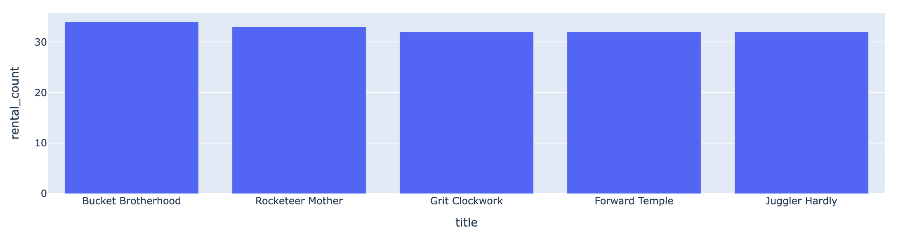

# Nvidia Inference Microservice(NIM) and Vanna.ai integration pattern 
Vanna.ai can connect to some LLM services such as Vanna SaaS, ChatGPT, Azure etc.  
However you may be able not to use cloud service because of your company policy or network policy etc.  
In this case, you must prepare a LLM service which has OpenAI compatible API in your environment. You can use many open LLM models but need to wrap it with an API interface, optimize for GPU, cache, health check, metric management etc...  
I'm lazy so I came up with an idea to use NIM as a local LLM service. NIM can provide all features AI services need I pointed before.

## Sample Architecture Overview
```bash
┌────────────────────────────────────────────────────────────────────────────────┐
│                                                                                │
│  ┌───────────────────────┐           ┌───────────────┐                         │
│  │       Kubeflow        │           │               │                         │
│  │┌─────────────────────┐│         ┌─►  PostgreSQL   │                         │
│  ││  Jupyter Notebook   ││         │ │               │                         │
│  ││                     ││         │ └───────────────┘                         │
│  ││ ┌─────────────────┐ ││         │                                           │
│  ││ │ Vanna Framework │ ││         │                                           │
│  ││ │  ┌───────────┐  ┼─┼┼──────┬──┘                                           │
│  ││ │  │ VectoreDB │  │ ││      │  ┌──────────────────────┐                    │
│  ││ │  │(ChromaDB) │  │ ││      │  │                      │                    │
│  ││ │  └───────────┘  │ ││      │  │          NIM         │       ┌───────────┐│
│  ││ └─────────────────┘ ││      └──► (llama-3-sqlcoder-8b)├───────┤    GPU    ││
│  ││                     ││         │                      │       └───────────┘│
│  │└─────────────────────┘│         └──────────────────────┘                    │
│  │                       │                                                     │
│  └───────────────────────┘                                                     │
│                                                                                │
│                                                                                │
│                        Kubernetes with Nvidia GPU operator                     │
│                                                                                │
└────────────────────────────────────────────────────────────────────────────────┘
```

## NIM Installation.
Please see [this article](../simple_test).  
And I used a PostgreSQL with [DVD rental dummy data](https://neon.tech/postgresql/postgresql-getting-started/postgresql-sample-database).

## How to implement
Nim has OpenAI API interface as default. You can make OpenAPI client for NIM and pass the client to Vanna framework.  
All details are in [notebook](vanna_nim.ipynb).

## Result Example
